# Chapter 6: Design a Key-Value Store

## Introduction

A **key-value store** is a type of non-relational database where data is stored as key-value pairs. Each key is unique, and values are accessed using these keys. This chapter details how to design a scalable, high-availability distributed key-value store that supports operations like:

- `put(key, value)` for inserting data.
- `get(key)` for retrieving data.

### Characteristics of the Design

- Small key-value pairs (<10 KB).
- Supports big data with high availability and scalability.
- Automatic scaling and tunable consistency.
- Low latency.

---

## Single Server Key-Value Store

### Implementation

- Use a **hash table** to store key-value pairs in memory.
- Optimizations:
  - Data compression.
  - Storing less frequently accessed data on disk.

### Limitation

A single server's memory is limited, requiring a **distributed approach** for scalability.

---

## Distributed Key-Value Store

A **distributed key-value store** partitions data across multiple servers and must address trade-offs outlined by the **CAP theorem**.

### CAP Theorem

1. **Consistency:** All clients see the same data simultaneously.
2. **Availability:** The system responds to every request, even if some nodes are down.
3. **Partition Tolerance:** The system continues to operate despite network partitions.

**Trade-off:** According to CAP theorem only two of the three guarantees can be achieved.

  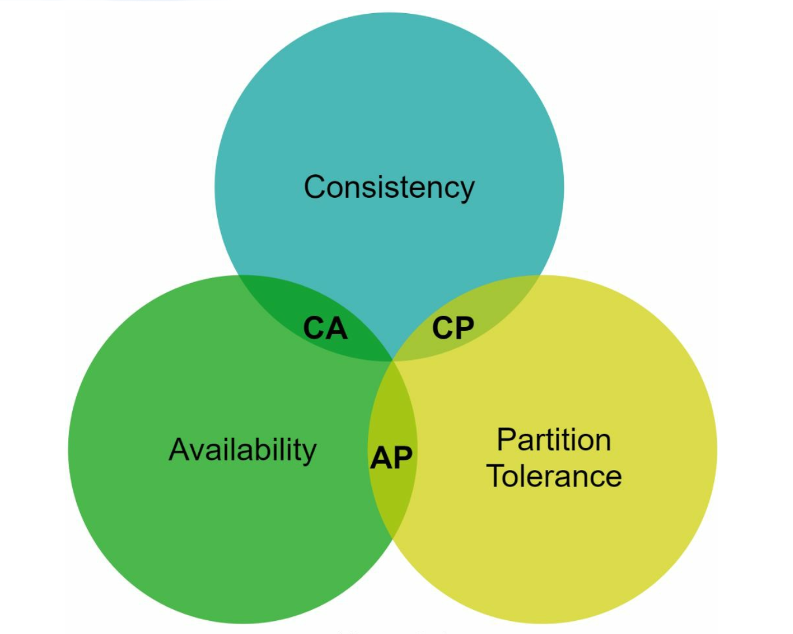

#### System Types:

- **CP Systems:** Consistency and partition tolerance while sacrificing availability (e.g., banking systems).
- **AP Systems:** Availability and partition tolerance while sacrificing consistency (e.g., eventual consistency).
- **CA Systems:** Consistency and Availability while sacrificing partition tolerance.

  **Since network failure is unavoidable, a distributed system must tolerate network partition. Thus, a CA system cannot exist in real-world applications.**

  In a distributed system, partitions are inevitable. When a partition occurs, we must choose between consistency and availability. For example, if node n3 goes down,
  any data written to nodes n1 or n2 cannot be propagated to n3. Conversely, if data is written to n3 but not yet propagated to n1 and n2, nodes n1 and n2 will have stale data.

    

    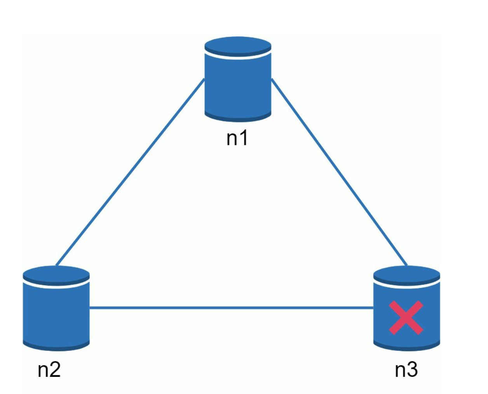
    

- If we choose CP system, we must block all write operations to n1 and n2 to avoid data inconsistency.
- If we choose AP system, the system keeps accepting reads, even though it might return stale data.
  For writes, n1 and n2 keep accepting writes,
  and data will be synced to n3 when the network partition is resolved.

---

## System Components

### 1. Data Partitioning

- **Technique:** Consistent Hashing is used to distribute data across multiple servers evenly.
- **Advantages:**
  - Automatic scaling with server addition/removal.
  - Heterogeneity through virtual nodes. The number of virtual nodes for a server is proportional to the server capacity.

### 2. Data Replication

- Replicate data across `N` servers for high availability.
- The N servers are chosen by walking clockwise from the server position and choose the first N servers on the ring to store data copies.Place replicas in distinct data centers to improve reliability in case of virtual nodes.

    

    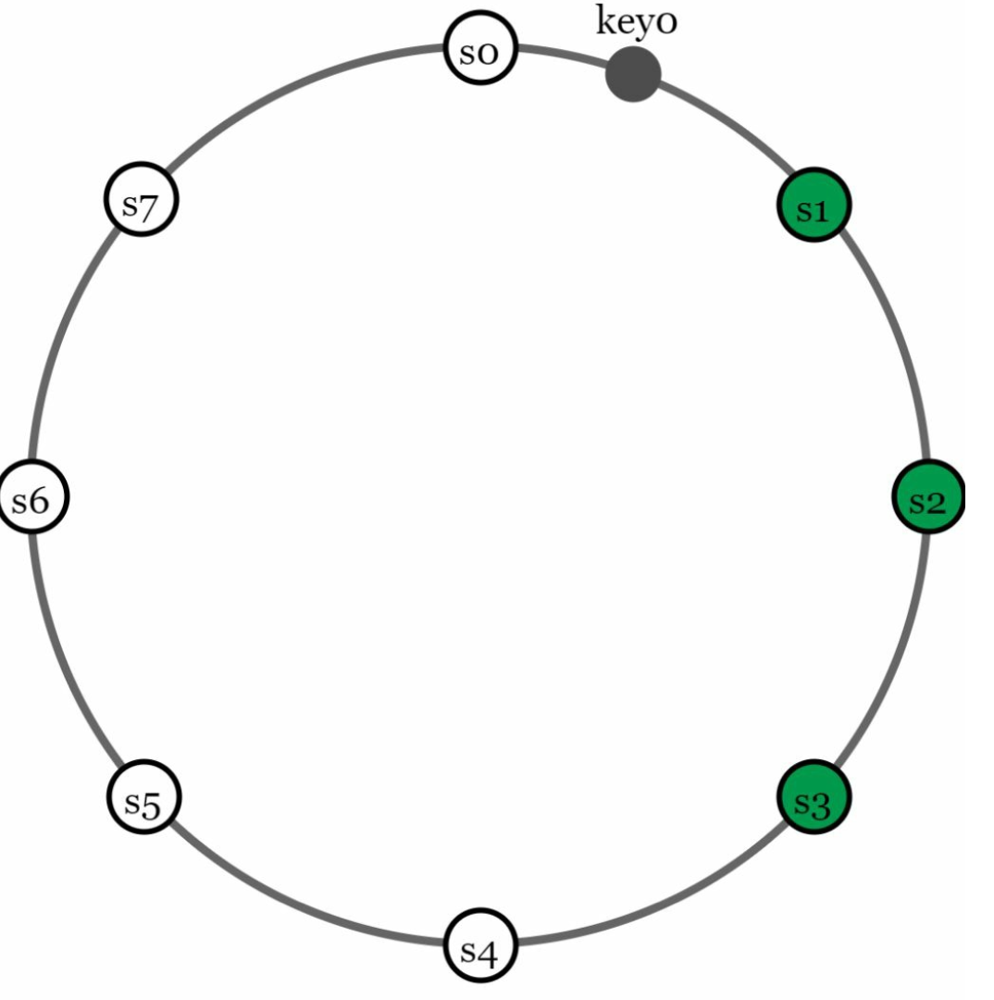
    

### 3. Consistency

Since data is replicated at multiple nodes, it must be synchronized across replicas.

- **Quorum Consensus:**

  - `N`: Total replicas.
  - `W`: Write quorum size. For a write to be considered successful, write must be acknowledged from W replicas.
  - `R`: Read quorum size. For a read to be considered as successful, read must wait for responses from at least R replicas.
  - **Rule:** `W + R > N` ensures strong consistency.
  - The configuration of W, R and N is a typical tradeoff between latency and consistency.

    

    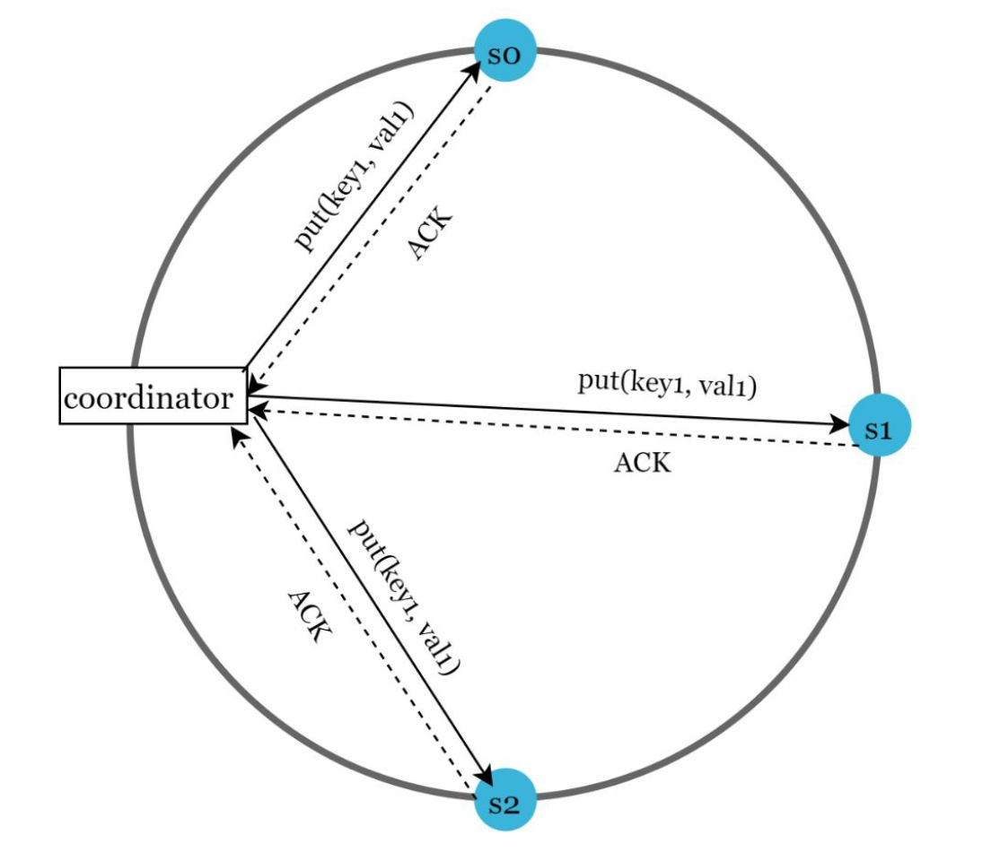
    

    - If R = 1 and W = N, the system is optimized for a fast read.
    - If W = 1 and R = N, the system is optimized for fast write.
    - If W + R > N, strong consistency is guaranteed (Usually N = 3, W = R = 2).
    - If W + R <= N, strong consistency is not guaranteed.

- **Models**:
  - **Strong Consistency:** A read operation returns a value corresponding to the result of the most updated write data item.
  - **Weak Consistency:** Subsequent read operations may not see the most updated value.
  - **Eventual Consistency:** Given enough time, all updates are propagated, and all replicas are consisten

### 4. Inconsistency Resolution

Replication gives high availability but causes inconsistencies among replicas. Versioning and
vector locks are used to solve inconsistency problems.

- **Versioning:**

  - Use **vector clocks** to track data versions and resolve conflicts.
  - Versioning means treating each data modification as a new immutable version of data.
      

      
      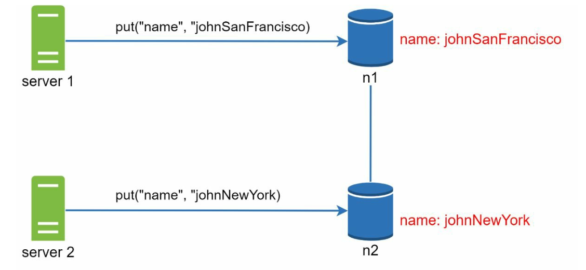
      

  - Server 1 changes the name , and server 2 also changes the name. These two changes are performed simultaneously. Now, we have conflicting values, called versions v1 and v2.

- **Vector Clock**

  1. **Setup**: A vector clock is a [server, version] pair associated with a data item. It can be used to check
     if one version precedes, succeeds, or in conflict with others.

     - Assume a vector clock represented by D([S1, v1], [S2, v2], …, [Sn, vn]), If data item D is written to server
       Si, the system must perform one of the following tasks.
     - Where: `D` is the data item.`Si` is the server identifier.`vi` is the version counter for the data at server `Si`.

  2. **Updating the Vector Clock:** When a data item is modified at a server:

     - If the server exists in the vector clock, its version counter is incremented.
     - Otherwise, a new entry is added to the vector clock.

  3. **Conflict Detection:**

     - **No Conflict:** A version X is an ancestor of version Y if all counters in X are less than or equal to those in Y.
     - **Conflict Exists:** Two versions are siblings if there is at least one counter in Y that is less than its counterpart in X.

  4. **Conflict Resolution:** When conflicts are detected (sibling versions), the system relies on application-specific logic or client intervention to reconcile the data.

  

  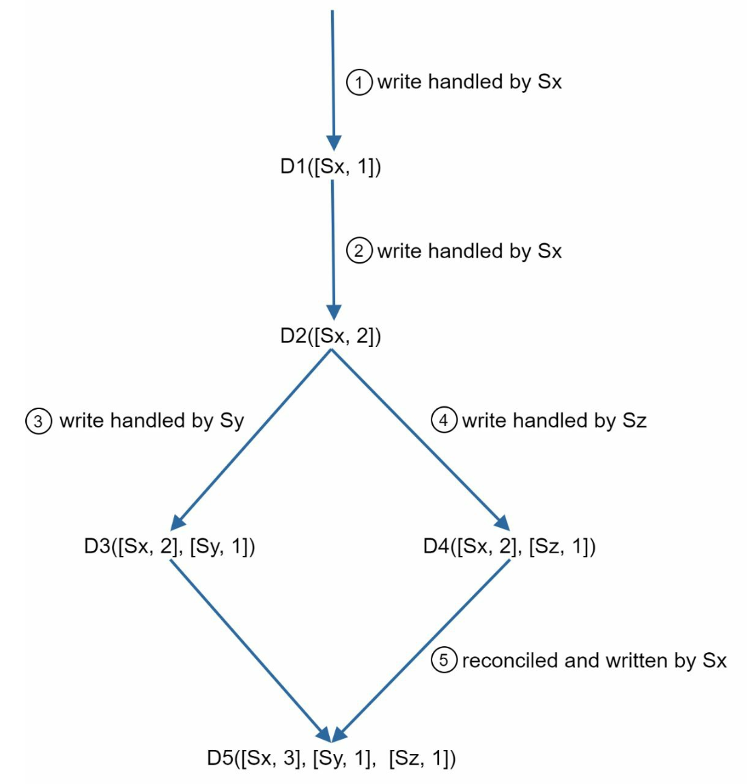
  

- **Challenges:**
  - Increased complexity for clients.
  - Vector clock size may grow with many updates, requiring trimming strategies to limit its size.

### 5. Handling Failures

#### a. Failure Detection

It is insufficient to believe that a server is down because another server says so.Usually, it requires at least two independent sources of information to mark a server down.

- **Gossip Protocol:**
    

        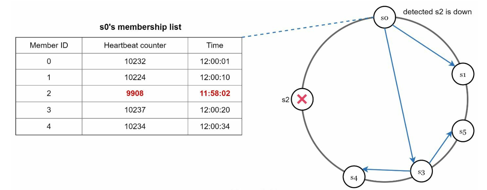
    

  - Each node maintains member IDs and heartbeat counters.
  - Each node periodically increments its heartbeat counter.
  - Each node periodically sends heartbeats to a set of random nodes.
  - If the heartbeat has not increased for more than predefined periods, the member is
    considered as offline

#### b. Temporary Failures

- **Sloppy Quorum:** Use healthy nodes to maintain operations temporarily.
  

  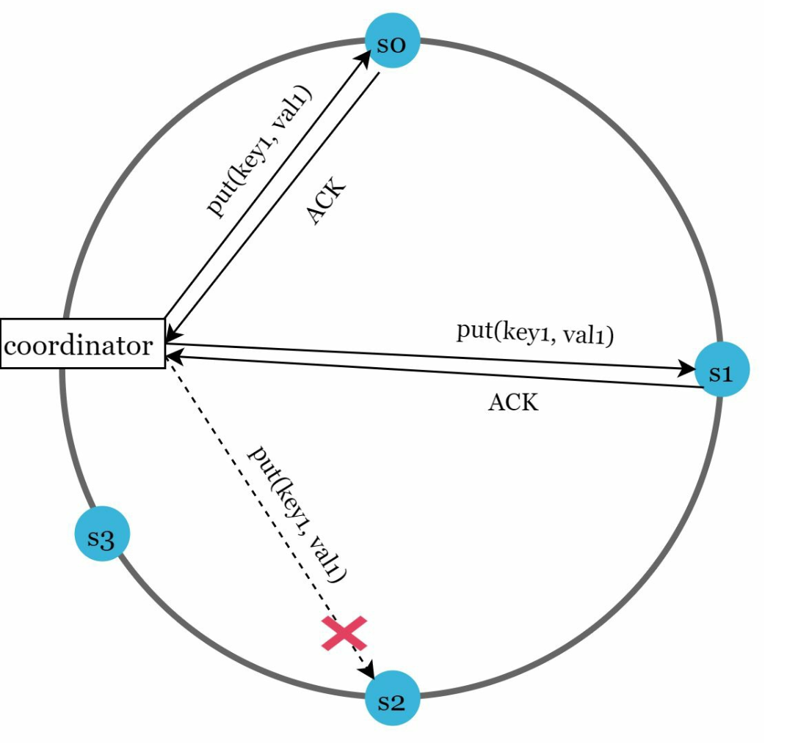
  

  - After detecting failures, the system needs to deploy certain mechanisms to ensure availability
  - Instead of enforcing the quorum requirement, the system chooses the first W healthy servers for writes and first R
    healthy servers for reads on the hash ring.
  - Offline servers are ignored. If a server is unavailable, another server will process requests temporarily

- **Hinted Handoff:** Offline servers catch up with changes upon recovery.
  - When the down server is up, changes will be pushed back to achieve data consistency

#### c. Permanent Failures

- Use **Merkle Trees** for efficient synchronization between replicas.
  A **Merkle Tree** (or hash tree) is a data structure to efficiently detect and resolve inconsistencies between replicas during permanent failures.

- Working

  1. **Structure:**

     - **Leaf Nodes** store the hash of individual data blocks.
     - **Non-Leaf Nodes** store the hash of their child nodes.
     - The **root hash** represents the combined state of all data in the tree.

  2. **Building a Merkle Tree:**

     - **Step 1:** Divide the key space into buckets.

         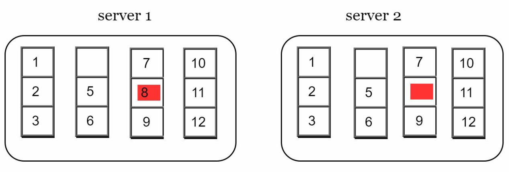

     - **Step 2:** Hash each key in a bucket using uniform hashing.

         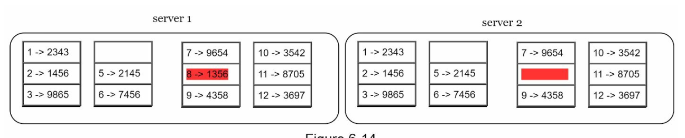

     - **Step 3:** Create a single hash for each bucket.

         

     - **Step 4:** Combine hashes of buckets to compute higher-level hashes, culminating in the root hash.

         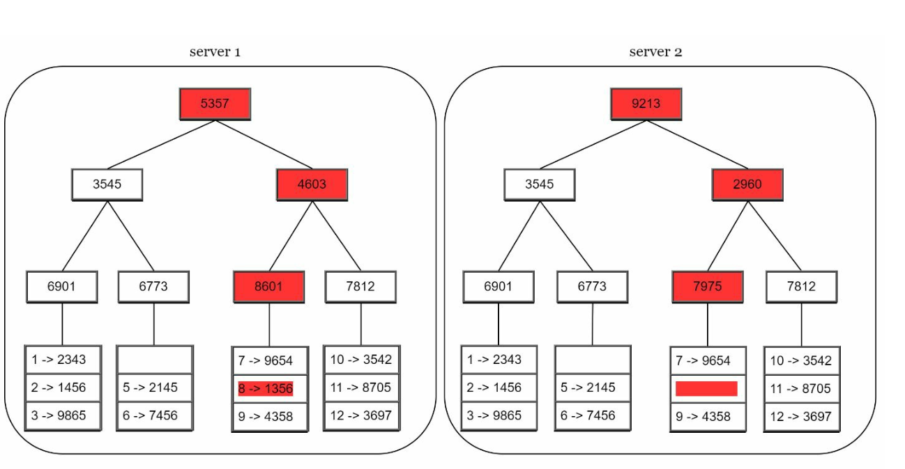

  3. **Synchronization:**
     - To synchronize two replicas:
       - Compare their root hashes.
       - If the root hashes match, the replicas are consistent.
       - If the root hashes differ, compare child hashes recursively to identify inconsistent buckets.
     - Only the inconsistent data is synchronized.

- Advantages
  - **Efficiency:** Only inconsistent data is synchronized, reducing data transfer.
  - **Scalability:** Effective for large datasets with minimal synchronization overhead.
  - **Reliability:** Ensures data consistency across replicas.

### 6. Handling Data Center Outages

- Replicate data across multiple data centers to ensure availability during outages.

---

## Write and Read Paths

### 1. Write Path (Based on Cassandra architecture)

    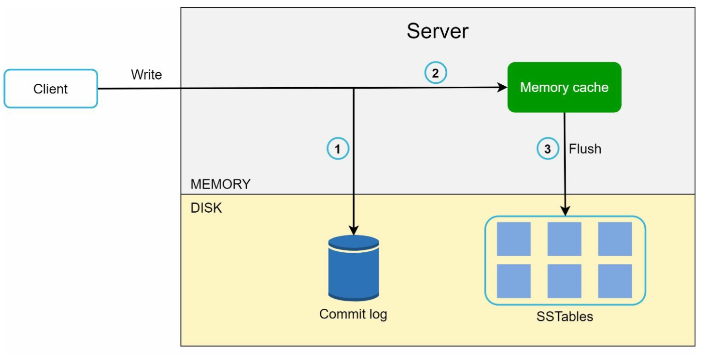

- Persist the write in a **commit log**.
- Save data to a **memory cache**.
- Flush data to **SSTable** (Sorted String Table) on disk when cache is full.

### 2. Read Path

    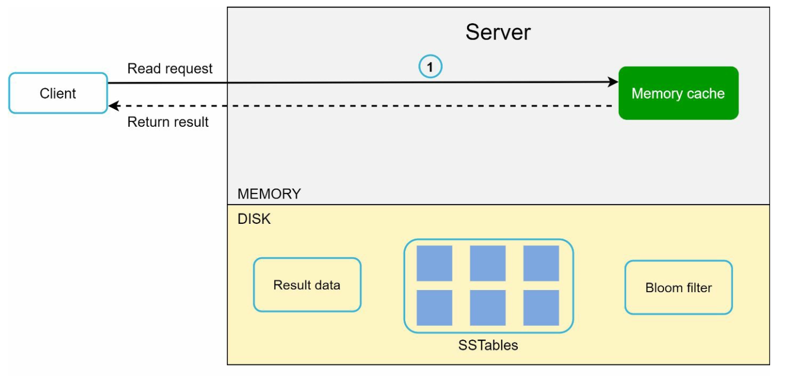
    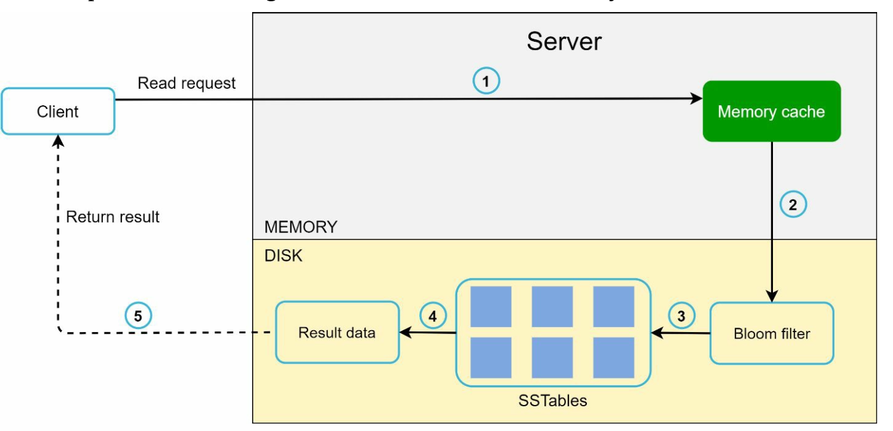

- Check **memory cache** for the data.
- If absent, use a **Bloom Filter** to locate the data in SSTables.
- Retrieve and return the data.

---

## Final Architecture

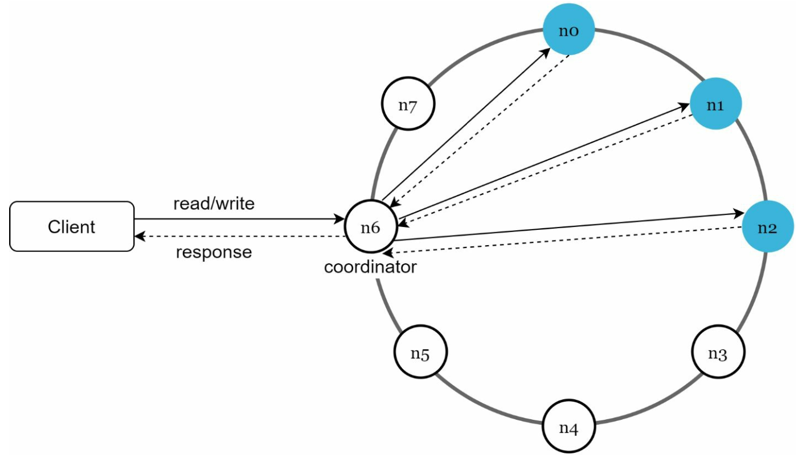

- Clients communicate with the key-value store through simple APIs: get(key) and put(key,
  value).
- A coordinator is a node that acts as a proxy between the client and the key-value store.
- Nodes are distributed on a ring using consistent hashing.
- The system is completely decentralized so adding and moving nodes can be automatic.
- Data is replicated at multiple nodes.
- There is no single point of failure as every node has the same set of responsibilities.
