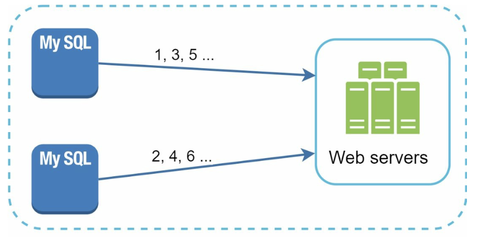
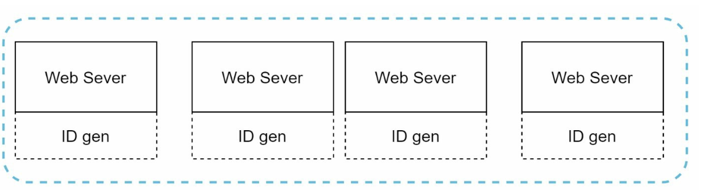
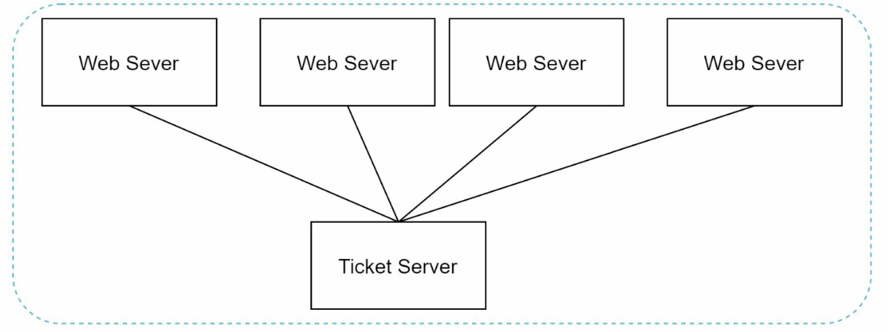
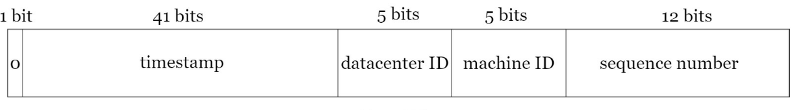
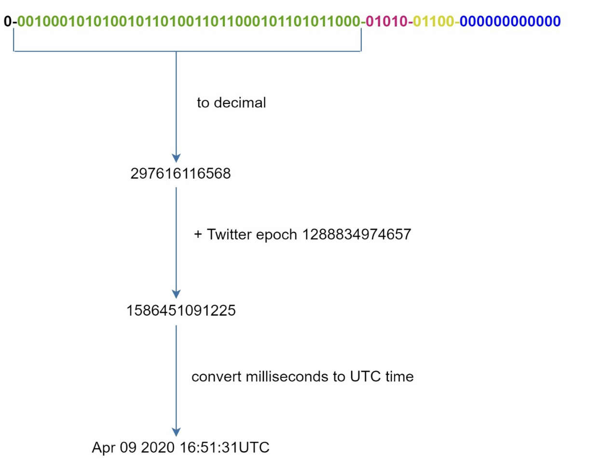

# Chapter 7: Design a Unique ID Generator in Distributed Systems

## Introduction

This chapter addresses the challenge of designing a **unique ID generator** for distributed systems. Traditional auto-increment keys are unsuitable in distributed environments due to scalability and synchronization challenges. The focus is on creating unique, sortable, 64-bit numerical IDs that meet the following requirements:

- IDs must be **unique** and **ordered by date**.
- IDs must fit within **64 bits**.
- The system should generate **over 10,000 IDs per second**.

---

## Step 1: Understanding the Problem

### Basic Requirements

- IDs must be unique and numerical and should fit in 64 bi.
- IDs increment with time but not strictly by `+1`.
- IDs should be sortable by date.
- System must handle high throughput (10,000 IDs/sec).

---

## Step 2: High-Level Design Options

### 1. Multi-Master Replication

- **Approach:** Use database `auto_increment` with step increments (e.g., `+k` for k servers).

    

    
    

- **Drawbacks:**
  - Hard to scale across data centers.
  - IDs do not always increase with time.
  - Scaling issues when servers are added/removed.

### 2. UUID (Universally Unique Identifier)

- **Approach:**

  - Generate 128-bit unique identifiers independently on each server using UUID.
  - UUIDs can be generated independently without coordination between servers

      

      
      

- **Advantages:**
  - No coordination needed between servers.
  - Scales easily with web servers.
- **Drawbacks:**
  - Exceeds 64-bit requirement.
  - IDs are not sortable by time and may be non-numeric.

### 3. Ticket Server

- **Approach:** Use a centralized database server to increment and assign IDs.

    

    
    

- **Advantages:**
  - Simple to implement for small-scale systems.
  - Generates numeric IDs.
- **Drawbacks:**
  - Single point of failure.
  - Synchronization challenges in multi-server setups.

### 4. Twitter Snowflake Approach

- **Approach:**

    

      
    

    

      
    

  - Divide IDs into sections to ensure uniqueness and scalability.
  - **Sign Bit (1 bit):** Always `0`, potentially distinguishing signed and unsigned numbers.
  - **Timestamp (41 bits):** Milliseconds since a custom epoch (Twitter's default is `1288834974657`, equivalent to Nov 04, 2010, 01:42:54 UTC). Ensures IDs are time-ordered.
  - **Datacenter ID (5 bits):** Identifies up to `2^5 = 32` datacenters.
  - **Machine ID (5 bits):** Identifies up to `2^5 = 32` machines within each datacenter.
  - **Sequence Number (12 bits):** Tracks IDs generated on a machine within the same millisecond, supporting up to `2^12 = 4096` IDs per millisecond. The sequence resets to `0` every millisecond.

- **Advantages:**
  - **Scalability:** Handles 10,000+ IDs per second across multiple servers.
  - **Time-Order:** Ensures IDs are sortable by time.
  - **Decentralization:** No single point of failure.

## Step 4: Additional Considerations

### 1. Clock Synchronization

- **Challenge:** ID generation assumes synchronized clocks across servers.
- **Solution:** Use **Network Time Protocol (NTP)** to minimize drift.

### 2. Section Length Tuning

- Adjust section sizes (e.g., fewer sequence bits, more timestamp bits) based on use case.

### 3. High Availability

- ID generators are mission-critical and must be fault-tolerant.
- Consider redundancy and failover mechanisms.
