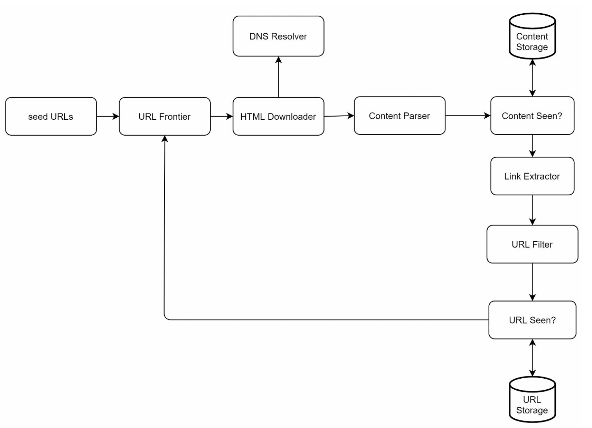
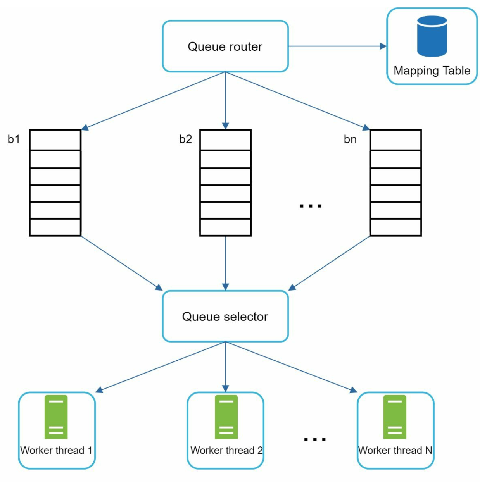
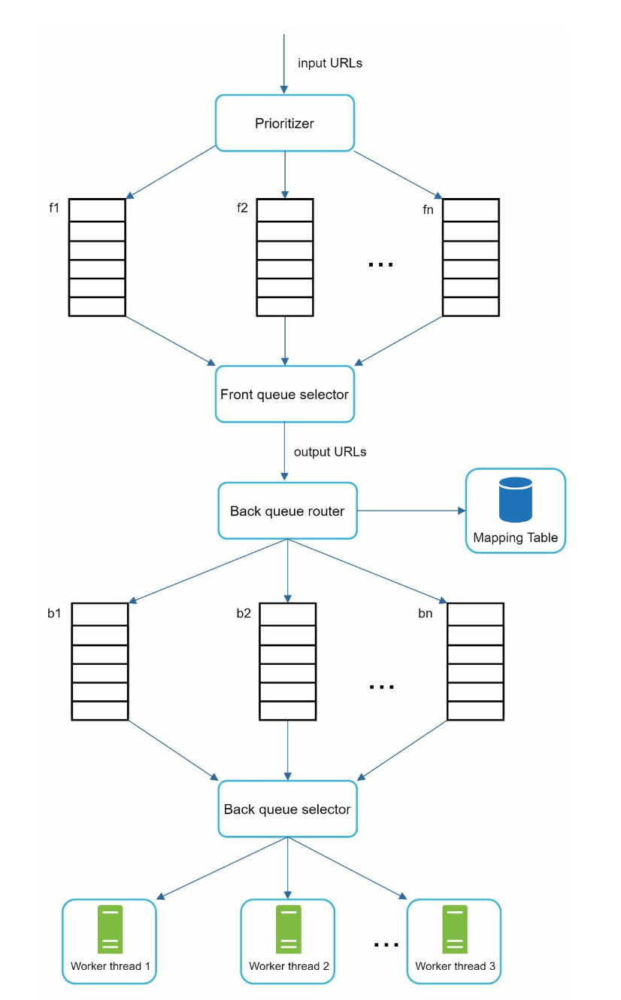
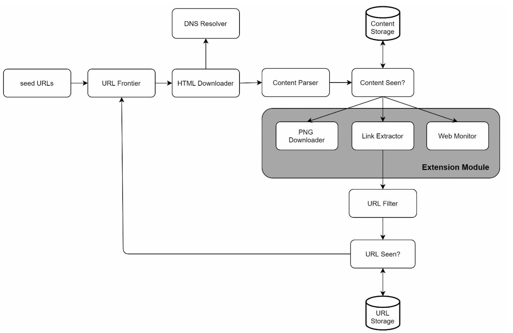

# Chapter 9: Design a Web Crawler

## Introduction

A **web crawler**, also known as a spider or robot, is used to discover and collect web content, such as web pages, images, and videos. This chapter focuses on designing a scalable web crawler for **search engine indexing**.

### Applications of Web Crawlers

1. **Search Engine Indexing:** Collect web pages to create searchable indexes (e.g., Googlebot).
2. **Web Archiving:** Preserve web data for future use (e.g., US Library of Congress).
3. **Web Mining:** Extract knowledge from web data (e.g., financial analysis of shareholder reports).
4. **Web Monitoring:** Detect copyright or trademark infringements.

### Design Challenges

A good web crawler must address:

- **Scalability:** Handle billions of pages using parallelization.
- **Robustness:** Manage bad HTML, crashes, and malicious links.
- **Politeness:** Avoid overwhelming servers with too many requests.
- **Extensibility:** Support new content types with minimal changes.

---

## Step 1: Understanding the Problem

### Requirements

1. Crawl **1 billion web pages per month** (400 pages/second, peak 800 QPS).
2. Collect **HTML-only content**.
3. Track new and updated pages.
4. Ignore duplicate content.
5. Store crawled data for **5 years**, requiring ~30 PB of storage.

---

## Step 2: High-Level Design

### Components

1. **Seed URLs:** Starting points for the crawler.

   - Need to selective as a good starting point that a crawler can utilize to traverse as many links as possible.
   - Can be based on locality based on different popular website or based on topics.
   - Strategies: Categorize by locality or topic (e.g., sports, healthcare).

2. **URL Frontier:** Stores URLs to be downloaded.

   - Implemented as a **FIFO queue**.

3. **HTML Downloader:** Downloads web pages from URLs provided by the URL Frontier.

4. **DNS Resolver:** Converts URLs to IP addresses.

5. **Content Parser:** Validates and parses web pages.

   - Discards malformed pages.

6. **Content Seen?:** Checks for duplicate content using hash comparisons (compare the hash values of the two web pages).

7. **Content Storage:** Stores HTML pages on disk (popular content in memory to reduce latency).

8. **URL Extractor:** Extracts new links from parsed pages.

9. **URL Filter:** Excludes blacklisted or erroneous URLs.

10. **URL Seen?** Tracks visited URLs to avoid duplication.

11. **URL Storage:** Stores already visited URLs.

---

### Workflow

1. Add **Seed URLs** to the URL Frontier.
2. **HTML Downloader** fetches URLs and resolves their IPs via the DNS Resolver.
3. **Content Parser** validates and passes content to the "Content Seen?" component.
4. If the content is new, extract links via the **URL Extractor**.
5. Filter and add unique links to the URL Frontier.

---

## Step 3: Deep Dive into Key Components

### DFS/BFS

- The web can be though of as a directed graph where web pages are nodes and hyperlinks (URLs) as edges.
- BFS is usually used for graph traversal as the depth can be be very deep thus DFS is not ideal.
- Standard BFS does not take the priority of a URL into consideration, not every page has the same level of quality and importance.

### URL Frontier

- **Politeness:**

  - Ensure only one request per host at a time. Add a dealy b/w two download tasks.
  - Use a mapping from hostnames to queues and worker (download) threads.
  - Each downloader thread has a separate FIFO queue and only downloads URLs from that queue.

      

  - **Queue router:** Ensures that each queue (b1, b2, … bn) only contains URLs from the same host.
  - **Mapping table:** It maps each host to a queue.
  - **Queue selector:** Each worker thread is mapped to a FIFO queue, and it only downloads URLs from that queue. The queue selection logic is done by the Queue selector.
  - **Worker thread 1 to N.** A worker thread downloads web pages sequentially from the same host. A delay can be added between two download tasks.

- **Priority:**

  - Assign higher priority to important pages (e.g., by PageRank or update frequency).

      

  - **Prioritizer:** It takes URLs as input and computes the priorities.
  - **Queue f1 to fn:** Each queue has an assigned priority. Queues with high priority are selected with higher probability.
  - **Queue selector:** Randomly choose a queue with a bias towards queues with higher priority.
  - **Front queues:** manage prioritization
  - **Back queues:** manage politeness

- **Freshness:** Recrawl based on update history or importance.

### HTML Downloader

- **Robots.txt Compliance:** Respect rules in robots.txt files.
- **Performance Optimizations:**
  1. Distributed crawling using multiple servers.
  2. Use a **DNS cache** to avoid repeated lookups.
  3. Geographically distribute crawl servers for faster downloads.
  4. Use a short timeout to avoid slow or unresponsive servers.

### Robustness

1. **Consistent Hashing:** Distribute load among servers effectively.
2. **Error Handling:** Prevent system crashes from exceptions.
3. **Data Validation:** Ensure content integrity.

### Extensibility

- Add modules for new content types (e.g., PNG downloader, web monitor).
- Example: Plug in a module to monitor web content for copyright violations.

    

---

### Avoiding Problematic Content

1. **Duplicate Content:** Detect using hash comparisons.
2. **Spider Traps:** Avoid infinite loops with techniques like URL length limits.
3. **Data Noise:** Filter irrelevant content like ads or spam.

---

## Step 4: Wrap Up

### Key Takeaways

1. Web crawlers must balance scalability, robustness, politeness, and extensibility.
2. **Politeness** prevents overloading servers, while **priority** ensures important pages are crawled first.
3. Efficient storage and error handling are crucial for handling large-scale crawling.

### Additional Considerations

- **Server-Side Rendering:** Handle dynamic content generated by JavaScript or AJAX.
- **Anti-Spam Measures:** Exclude low-quality or irrelevant pages.
- **Database Sharding:** Scale the data layer using replication and sharding.
- **Horizontal Scaling:** Use stateless servers to scale crawl jobs efficiently.
- **Analytics:** Collect and analyze data for insights.
