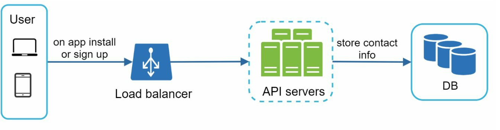
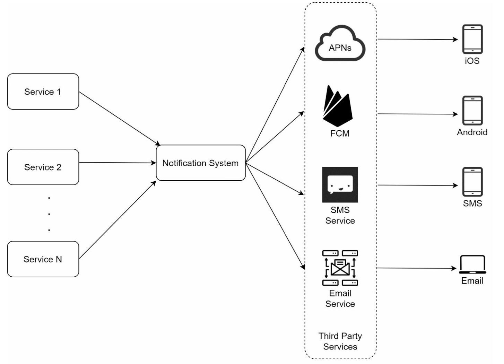
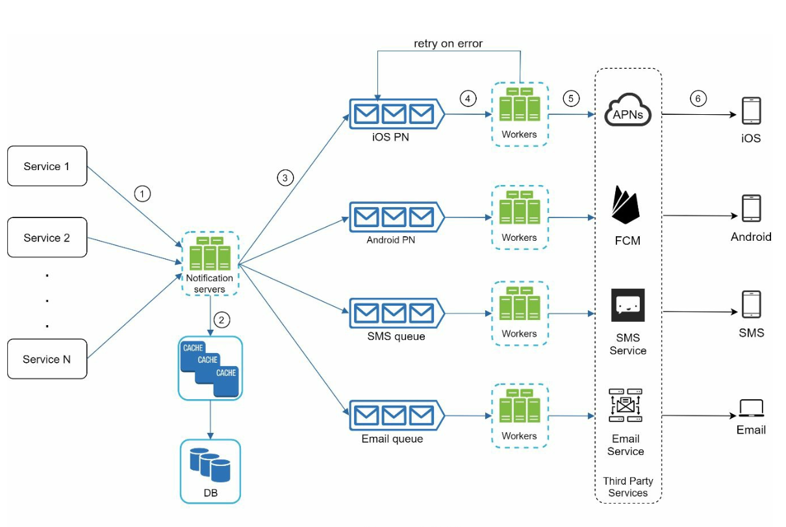
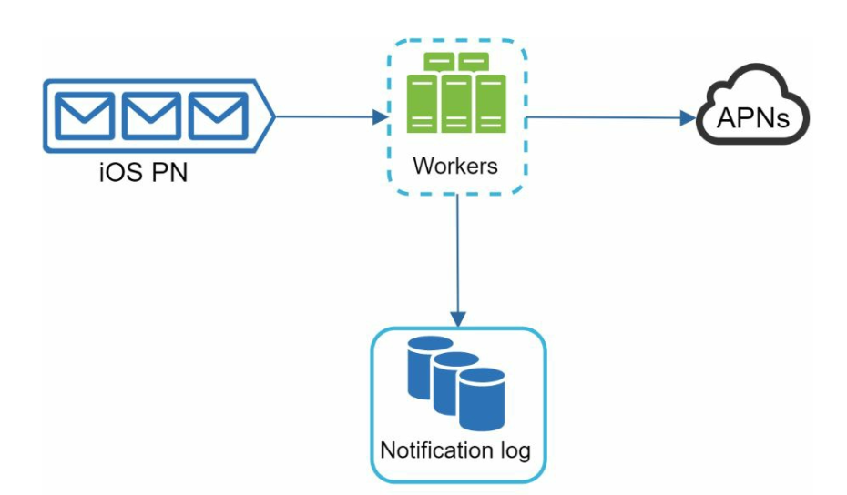
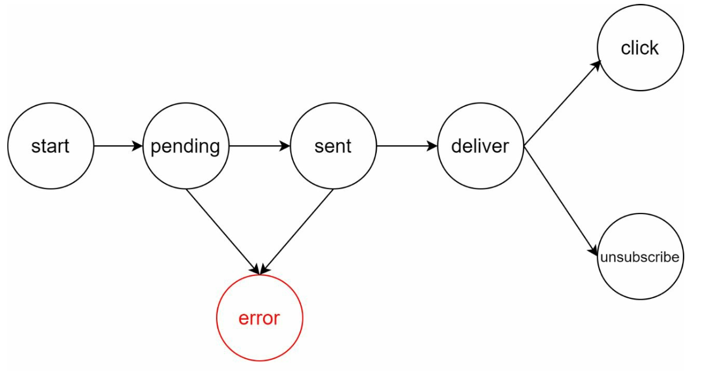
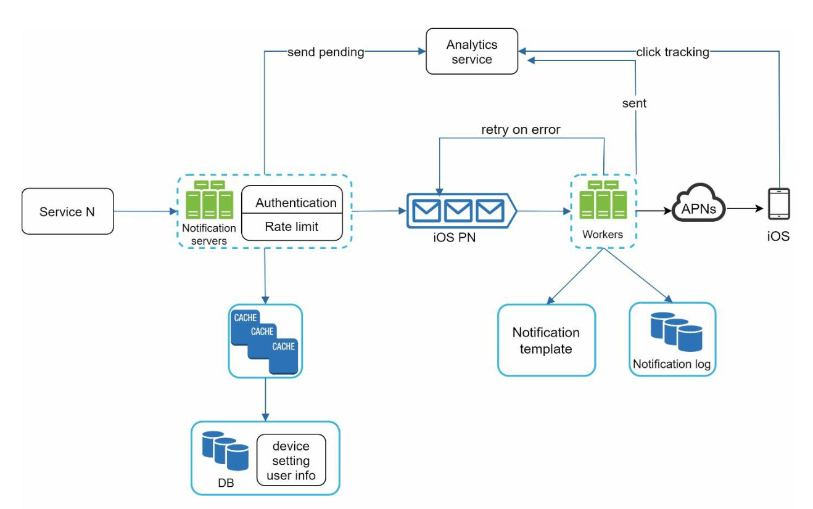

# Chapter 10: Design a Notification System

## Introduction

A **notification system** is essential for modern applications, providing timely updates like product notifications, events, offers, and alerts. Notifications can be sent through:

1. **Push notifications** (mobile or desktop),
2. **SMS messages**, and
3. **Emails**.

The chapter focuses on designing a scalable system capable of sending millions of notifications daily.

---

## Step 1: Understanding the Problem

### Requirements

- **Notification Types:** Push notifications, SMS, and Emails.
- **Delivery:** Soft real-time system with minimal delays.
- **Platforms:** iOS, Android, and desktop.
- **Triggers:** Notifications can be triggered by client applications or scheduled on servers.
- **Scale:**
  - **Push Notifications:** 10 million/day,
  - **SMS:** 1 million/day,
  - **Emails:** 5 million/day.
- **Opt-out Support:** Users can disable specific notification types.

---

## Step 2: High-Level Design

### Components

1. **Notification Types:**

   - **iOS Push Notifications:** Use **Apple Push Notification Service (APNS)**.
   - **Android Push Notifications:** Use **Firebase Cloud Messaging (FCM)**.
   - **SMS Messages:** Third-party services like Twilio or Nexmo.
   - **Emails:** Commercial email services like SendGrid or Mailchimp.

2. **Contact Info Gathering:**
   

      
   

   - Collect device tokens, phone numbers, or email addresses during app installation or signup.
   - Store contact info in the database:
     - **Device Tokens Table:** For push notifications.
     - **User Table:** For emails and phone numbers.

3. **Notification Sending Flow:**

   

      
   

   - **Trigger Services:**
     - Generate events to initiate notifications (e.g., billing reminders, shipping updates).
     - A service can be a micro-service, a cron job, or a distributed system that triggers notification sending events.
   - **Notification Server:**
     - Provide APIs for services to send notifications.
     - Carry out basic validations to verify emails, phone numbers.
     - Query the database or cache to fetch data needed to render a notification.
   - **Third-Party Services:** Deliver notifications to users.

### Challenges in Initial Design

- **Single Point of Failure (SPOF):** One notification server can crash the entire system.
- **Scalability Issues:** Hard to scale databases, caches, and processing components independently.
- **Performance Bottlenecks:** High resource demands for sending notifications.

### Improved Design

   

      
   

- Move databases and caches out of the notification server.
- Introduce **horizontal scaling** with multiple notification servers.
- Use **message queues** to decouple system components.
  - Message queues serve as buffers when high volumes of notifications are to be sent out.
- Add workers that pull notification events from message queues and send them to corresponding third party services.

---

## Step 3: Design Deep Dive

### Reliability

1. **Prevent Data Loss:**
   

   
   

   - Persist notification data in a database and implement a retry mechanism.
   - The Notification log database is included for data persistence.

2. **Deduplication:**
   - Check event IDs to avoid sending duplicate notifications.
   - When a notification event first arrives, check if it is seen before by checking the event ID.
     If seen before discard it, otherwise send out the notification.

### Additional Components

   

   
   

1. **Notification Templates:** Preformatted templates for consistent and efficient notifications.
2. **Notification Settings:**
   - Users can opt-in or opt-out for specific channels (push, SMS, or email).
   - Stored in a dedicated notification settings table.
3. **Rate Limiting:** Cap the frequency of notifications sent to users.
4. **Retry Mechanism:** Retry sending notifications if third-party services fail.
5. **Monitoring Queues:** Track queued notifications to scale workers dynamically.
6. **Event Tracking:** Collect metrics like open rate, click rate, and engagement.

### Security

- Use **AppKey** and **AppSecret** to authenticate and secure APIs for push notifications.

### Notification Flow

   

   
   

1. Trigger services call APIs to send notifications.
2. Notification servers validate requests and fetch metadata from caches or databases.
3. Notification events are sent to message queues.
4. Workers process events and interact with third-party services.
5. Third-party services deliver notifications to users.

---

## Key Optimizations

1. **Horizontal Scaling:** Add more notification servers for load distribution.
2. **Message Queues:** Decouple processing to handle high volumes.
3. **Caching:** Reduce latency by caching frequently accessed data.
4. **Distributed Crawling:** Optimize message delivery geographically for better performance.
