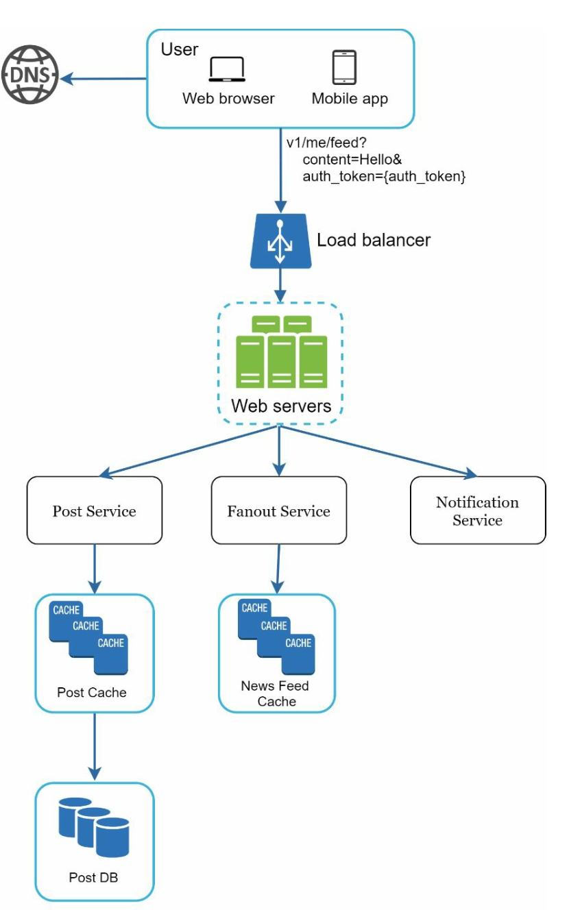
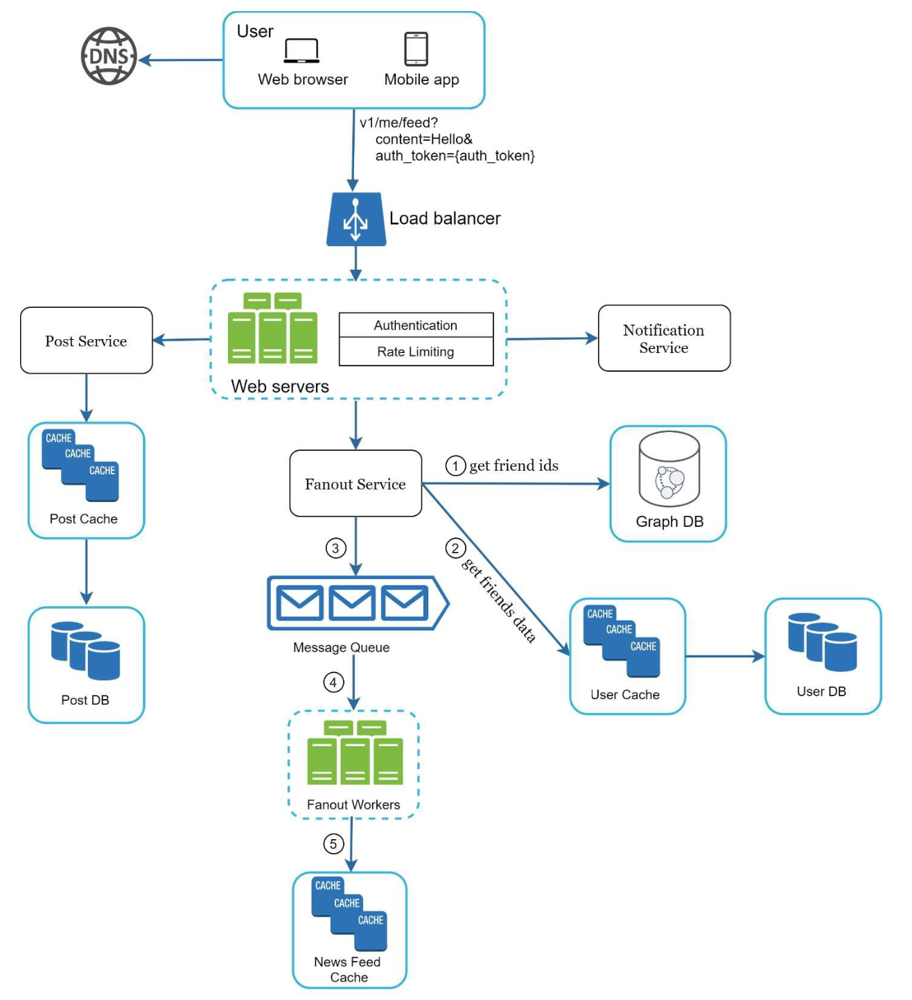
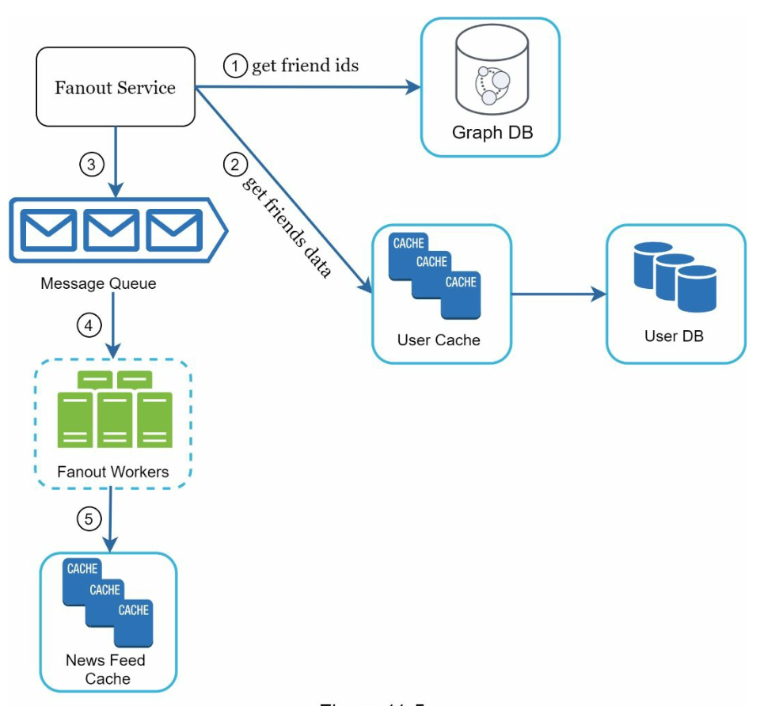
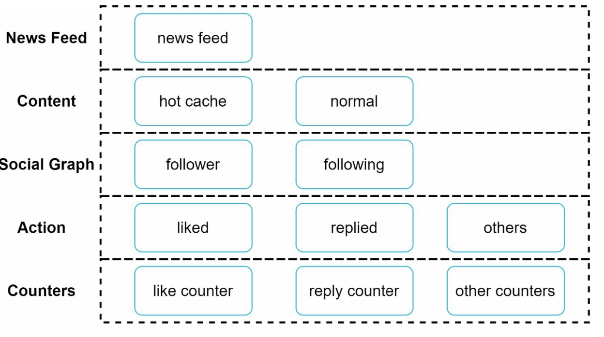

# Chapter 11: Design a News Feed System

## Introduction

A **news feed system** displays a constantly updating list of posts (status updates, photos, videos, and links) from a user’s connections. Examples include Facebook’s news feed, Instagram’s feed, and Twitter’s timeline. This chapter explores the design of a scalable news feed system.

---

## Step 1: Understanding the Problem

### Requirements

1. **Platform:** The system supports both web and mobile apps.
2. **Features:**
   - Users can publish posts.
   - Users can view posts from friends in their news feed.
3. **Sorting:** Feeds are sorted in **reverse chronological order** for simplicity.
4. **Scale:**
   - Users can have up to 5,000 friends.
   - 10 million daily active users (DAU).
   - Feeds may include text, images, and videos.

---

## Step 2: High-Level Design

### Overview

The design includes two main flows:

1. **Feed Publishing:** A user publishes a post, which is written to the database and propagated to their friends’ feeds.
2. **News Feed Building:** A user retrieves their news feed by aggregating posts from friends in reverse chronological order.

---

### News Feed APIs

1. **Feed Publishing API:**

   - **Endpoint:** `POST /v1/me/feed`
   - **Params:** `content` (post text) and `auth_token` (authentication).

2. **News Feed Retrieval API:**
   - **Endpoint:** `GET /v1/me/feed`
   - **Params:** `auth_token` (authentication).

---

### Feed Publishing

   

      
   

1. **User Interaction:** The user publishes a post via the feed publishing API.
2. **Load Balancer:** Distributes traffic to web servers.
3. **Web Servers:** Authenticate requests and redirect to services.
4. **Post Service:** Stores the post in the database and cache.
5. **Fanout Service:** Propagates the post to friends’ news feeds in the cache.
6. **Notification Service:** Sends notifications to friends.

---

### News Feed Building

   

      
   

1. **User Interaction:** The user requests their news feed via the retrieval API.
2. **Load Balancer:** Distributes traffic to web servers.
3. **Web Servers:** Forward requests to the news feed service.
4. **News Feed Service:** Fetches post IDs from the news feed cache and retrieves complete post details from the database or cache.

---

## Step 3: Design Deep Dive

### Feed Publishing Deep Dive

1. **Web Servers:**

   - Authenticate users using `auth_token`.
   - Enforce rate limits to prevent spam.

2. **Fanout Service:**

   - **Fanout on Write:** Push posts to friends’ feeds at write time.
     - **Pros:** Real-time updates, fast feed retrieval.
     - **Cons:** Resource-intensive for users with many friends.
   - **Fanout on Read:** Pull posts at read time.
     - **Pros:** Efficient for inactive users.
     - **Cons:** Slower feed retrieval.
   - **Hybrid Approach:** Use a push model for most users and a pull model for high-connection users (e.g., celebrities).

        

   The **fanout service** works as following:

   1. **Fetch Friend IDs:** Retrieve the friend list from a graph database.
   2. **Filter Friends from Cache:** Access user settings in the cache to exclude certain friends (e.g., muted friends or selective sharing preferences).
   3. **Send to Message Queue:** Send the filtered friend list along with the new post ID to a message queue for processing.
   4. **Fanout Workers:** Workers retrieve data from the message queue and update the news feed cache. The cache stores `<post_id, user_id>` mappings instead of full user and post objects to save memory.
   5. **Store in News Feed Cache:** Append new post IDs to the friends’ news feed cache. A configurable limit ensures that only recent posts are stored, as most users focus on the latest content, keeping cache memory consumption manageable.

   

## News Feed Retrieval Deep Dive

### Cache Architecture

The cache is divided into five layers:

1. **News Feed Cache:** Stores post IDs for quick retrieval.
2. **Content Cache:** Stores post details (popular posts in hot cache).
3. **Social Graph Cache:** Stores user relationship data.
4. **Action Cache:** Tracks user actions (likes, replies, shares).
5. **Counter Cache:** Maintains counts for likes, replies, followers, etc.

---

## Key Optimizations

### Scaling

1. **Database Scaling:**
   - Horizontal scaling and sharding.
   - Use of read replicas for high-traffic queries.
2. **Stateless Web Tier:** Keep web servers stateless to enable horizontal scaling.

### Caching

1. Store frequently accessed data in memory.
2. Use cache layers to reduce latency and database load.

### Reliability

1. **Consistent Hashing:** Distribute requests evenly across servers.
2. **Message Queues:** Decouple system components and buffer traffic.

### Monitoring

1. Track key metrics like QPS (queries per second) and latency.
2. Monitor cache hit rates and adjust configurations accordingly.
