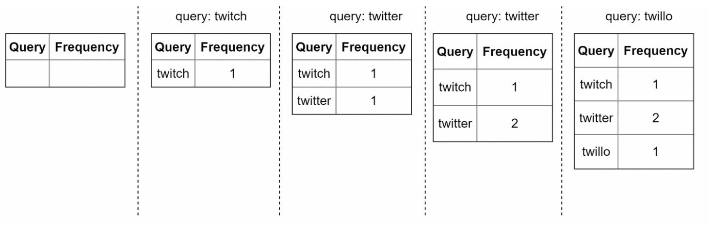
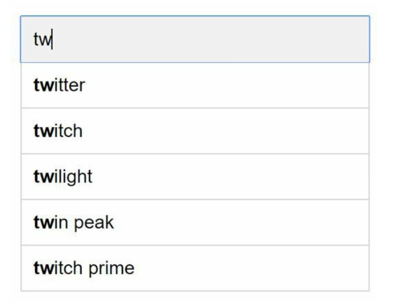
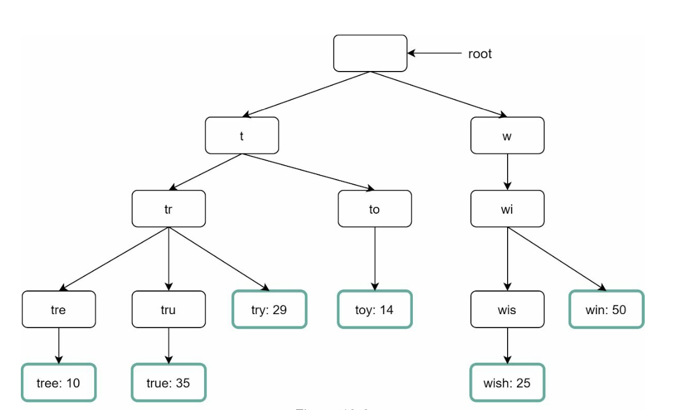
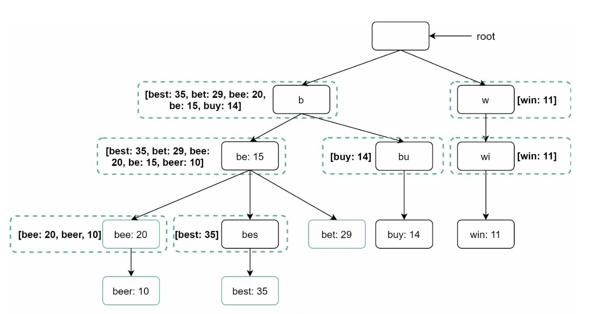
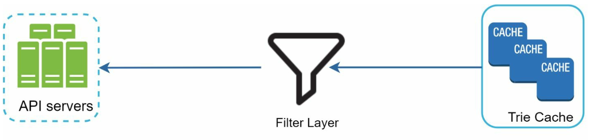
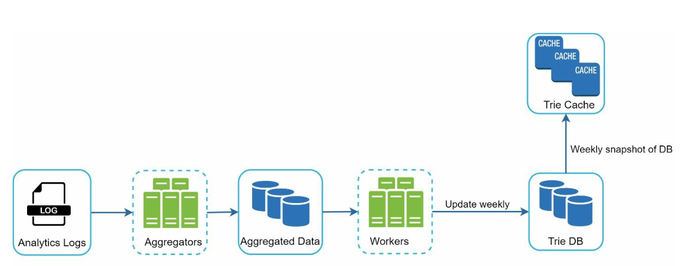
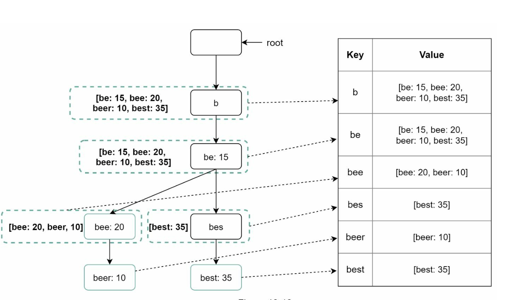
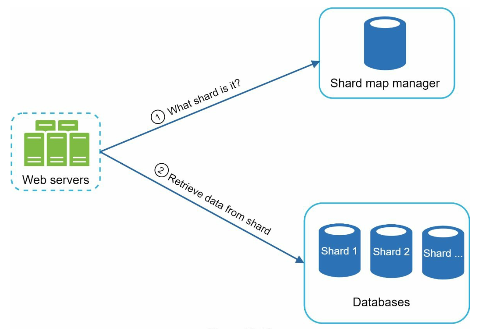

# Chapter 13: Design a Search Autocomplete System

## Introduction

Autocomplete, also known as typeahead or incremental search, provides real-time suggestions to users as they type in search boxes. The system must efficiently deliver top-k relevant and popular suggestions based on historical query data.

### Key Features

- Suggest up to **5 autocomplete results**.
- Based on **query popularity** (frequency).
- Support only **lowercase English characters**.
- Fast response time (<100 ms) and scalable.

---

## Step 1: Understanding the Problem

### Requirements

1. **Real-Time Suggestions:** Display relevant matches as the user types.
2. **Top-k Results:** Return up to 5 results sorted by popularity.
3. **Scalability:** Handle **10 million DAU** with a peak QPS of **48,000**.
4. **High Availability:** Handle failures without system downtime.
5. **Data Growth:** Support daily storage growth of **0.4 GB** for new query data.

---

## Step 2: High-Level Design

At the high-level, the system is broken down into two services:

1. **Data Gathering Service:**

   - Collects user queries and aggregates them for frequency analysis in real-time.
   - Real-time processing is not practical for large data sets; however, it is a good starting point

2. **Query Service:** Provides the top-k suggestions based on the user’s input.

---

### Data Gathering Service

    

- Aggregates query data from analytics logs and updates the frequency table.
- Processes historical data weekly to build a **trie** (prefix tree).

### Query Service

    
    

- Uses the frequency table from data gathering service.
- Processes user input and retrieves top-k suggestions from the frequency table using a Trie.
- Optimized for fast lookups using caching and efficient data structures.
- For example when a user types “tw” in the search box, the following top 5 searched queries are displayed.

---

## Step 3: Design Deep Dive

### Trie Data Structure

The **trie** is a tree-like data structure used to store and retrieve query strings efficiently.

#### Key Features

1. **Compact Storage:** Represents prefixes hierarchically to minimize redundancy.
2. **Frequency Information:** Stores the popularity of queries at each node.

3. **Steps to get top k most searched queries**
   

      
   

   - Find the prefix
   - Traverse the subtree from prefix node to get all valid children
   - Sort the children and get top k

4. **Optimizations:**

   - Cache top-k queries at each node to speed up retrieval and avoid traversing the whole trie.

        

   - Limit prefix length to reduce search space as users rarely type a loong search query (say 50).

#### Trie Operations

1. **Create:**
   - Built weekly using aggregated query data.
   - The source of data is from Analytics Log/DB.
2. **Update:** Rarely updated in real-time; weekly updates replace old data.
3. **Delete:**
     

        
     

   - Filters remove unwanted or harmful suggestions (e.g., hate speech).
   - Having a filter layer gives us the flexibility of removing results based on different filter rules.
   - Unwanted suggestions are removed physically from the database asynchronically.

---

### Query Processing Flow

1. **Prefix Search:**
   - Identify the prefix node corresponding to the user’s input.
   - Traverse the subtree to collect valid suggestions.
2. **Top-k Sorting:**
   - Cache top-k suggestions at each node to minimize sorting overhead.
3. **Response Construction:**
   - Construct results using cached data for fast response times.

---

### Optimizations

1. **Cache at Each Node:**
   - Store the top-k queries to avoid redundant traversals.
2. **Limit Prefix Length:**
   - Cap prefix length to a small value (e.g., 50 characters) for faster lookups.
3. **AJAX Requests:**
   - Use lightweight asynchronous requests for real-time responses.
4. **Browser Caching:**
   - Save autocomplete results in the browser cache for frequently searched terms.

---

### Data Gathering Pipeline

In the high-level design, whenever a user types a search query, data is updated in real-time. This appraoch is not practical.

- Users may enter billions of queries per day. Updating the trie on every query is not feasible.
- Top suggestions may not change much one the trie is built.

#### Updated Design

   

1. **Analytics Logs:**
   - Stores raw query data as logs for weekly aggregation.
   - Logs are append-only and are not indexed
2. **Aggregators:**
   - Process logs into frequency tables, suitable for trie construction.
   - For real-time applications such as Twitter, aggregate data in a shorter time interval.
   - For other cases, aggregating data less frequently, say once per week is good enough.
3. **Workers:**
   - Asynchronous servers rebuild the trie and store it in persistent storage.
4. **Storage Options:**

   - **Trie Cache**: Trie Cache is a distributed cache system that keeps trie in memory for fast read.
   - **Trie DB**

     1. **Document Store (e.g., MongoDB)**: Since a new trie is built weekly, we can periodically take a snapshot of it, serialize it, and store the serialized data in the database like MongoDB
     2. **Key-Value Store:**

        - Maps prefixes to node data for fast access.
        - Every prefix in the trie is mapped to a key in a hash table.
        - Data on each trie node is mapped to a value in a hash table.

            

---

### Scalability

1. **Sharding:**
   - Distribute trie nodes across servers based on prefix ranges (e.g., `a-m`, `n-z`).
   - Further shard within prefixes to balance uneven distributions (e.g., `aa-ag`, `ah-an`).
2. **Load Balancing:**
   

      
   

   - Use a shard map manager to route requests to the appropriate server.

---

## Step 4: Advanced Features

### Multi-Language Support

1. **Unicode Characters:** Use Unicode to support non-English languages.
2. **Country-Specific Tries:** Build separate tries for different countries or regions.

### Trending Queries

- Handle real-time events by dynamically updating trie nodes or weighting recent queries more heavily.
