# Chapter 14: Design YouTube

## Introduction

YouTube is a massive video streaming platform supporting video uploads, playback, and various interactions. This chapter focuses on designing a scalable video streaming system with the following core features:

- **Fast video uploads**
- **Smooth video streaming**
- **Ability to change video quality**
- **Low infrastructure cost**
- **High availability and reliability**

### Key Statistics (2020)

- **2 billion monthly active users**
- **5 billion videos watched per day**
- **37% of mobile internet traffic comes from YouTube**
- Available in **80 languages**
- **$15.1 billion ad revenue** in 2019

---

## Step 1: Understand the Problem and Scope

### Core Functionalities

1. Upload videos
2. Watch videos

### Supported Platforms

- Mobile apps, web browsers, and smart TVs

### Assumptions

- **Daily Active Users (DAU):** 5 million
- **Average Video Size:** 300 MB
- **Upload Limits:** Max 1 GB per video
- **Daily Storage Need:** 150 TB
- **CDN Costs:** 5 million _ 5 videos _ 0.3GB \* $0.02 = $150,000/day (using Amazon CloudFront)

---

## Step 2: High-Level Design

### Components

    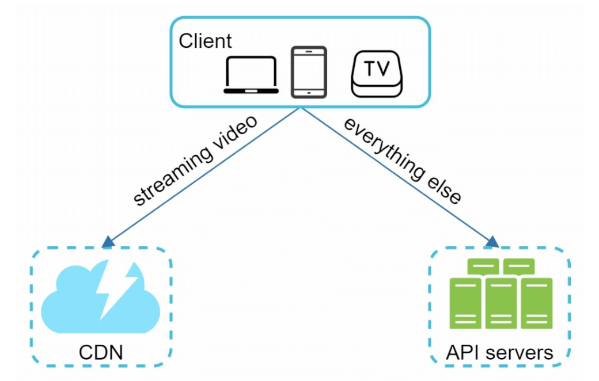

1. **Client:** Devices like smartphones, computers, and TVs.
2. **CDN (Content Delivery Network):** Stores and streams videos.
3. **API Servers:** Handles all user interactions except video streaming (e.g., uploads, metadata updates).
4. **Metadata Database:** Stores video metadata (e.g., title, description, size).
5. **Original Storage:** Blob storage for uploaded videos.
6. **Transcoding Servers:** Convert videos into multiple resolutions and formats.
7. **Transcoded Storage:** Blob storage for transcoded videos.

---

### Core Workflows

#### 1. Video Uploading Flow

- **Parallel Processes:**

  1. Upload video to original storage.
  2. Update video metadata in the database.

- **Video Upload (Steps):**

    

        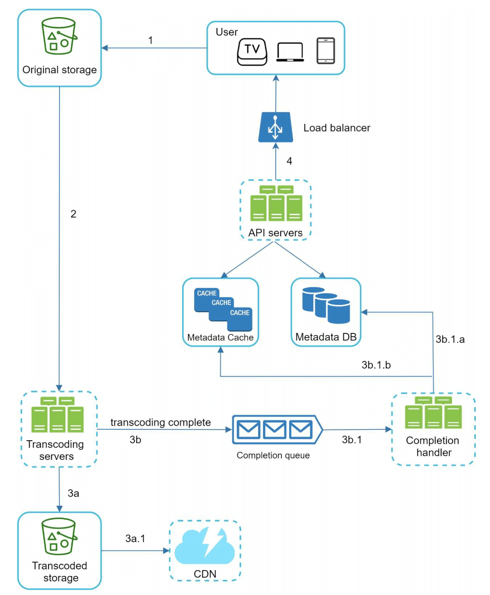
    

  - [1] Videos are uploaded to blob storage.
  - [2] Transcoding servers convert videos to multiple formats.
  - [3] One trasncoding is complete, following two steps are exectued in parallel.
    - [3a] Transcoded videos are sent to transcoded storage.
    - [3b] Transcoding completion events are queued in the completion queue.
  - [3a.1] Videos are distributed to the CDN.
  - [3b.1] Completion handlers update metadata and inform users.

- **Metadata Upload (Steps):**

    

        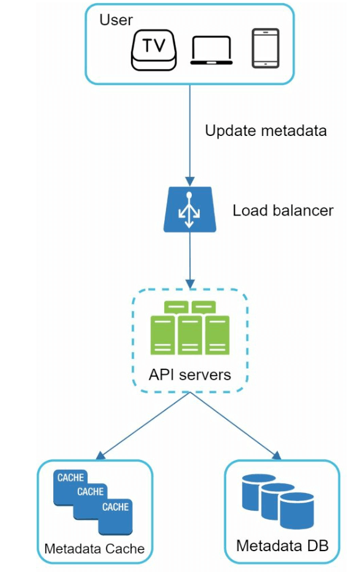
    

  - The client in parallel sends a request to update the video metadata
  - The request contains video metadata, including file name, size, format, etc.

#### 2. Video Streaming Flow

  

- Videos are streamed directly from the CDN using edge servers to minimize latency.
- Some of te popular streaming protocols are MPEG_DASH, Apple HLS, Adobe HDS.
- _Different streaming protocols support different video encodings and playback players._

---

## Step 3: Design Deep Dive

### Video Transcoding

#### Importance

1. Raw video consumes large amounts of storage space. It Reduces storage space.
2. Ensures compatibility across devices and browsers.
3. Adapts video quality to network conditions.

#### Components

- **Container:** Encapsulates video, audio, and metadata (e.g., MP4, AVI).
- **Codecs:** Compression and Decompression algorithms (e.g., H.264, VP9).

#### Directed Acyclic Graph (DAG) Model

    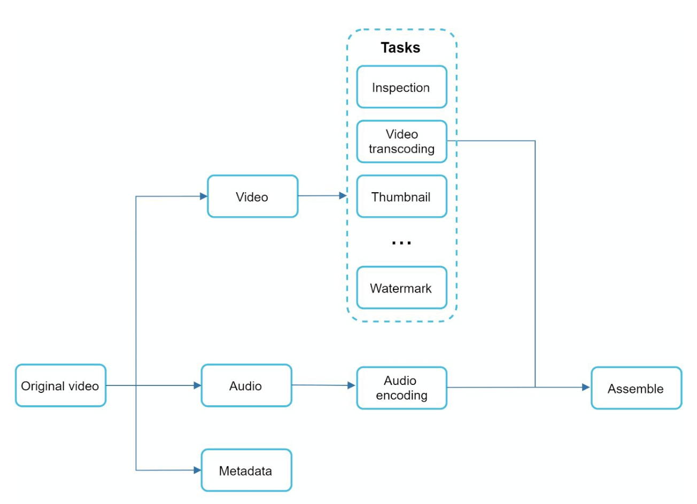

- Transcoding a video is computationally expensive and time-consuming.
- DAG Model defines tasks like encoding, thumbnail generation, and watermarking.
- Allows high parallelism in video processing.

- The original video is split into video, audio, and metadata.
  - Video encodings: Videos are converted to support different resolutions, codec, bitrates.
  - Thumbnail: It can either be uploaded by a user or automatically generated bythe system.
  - Watermark: Image overlay on top of your video contains identifying information about the video.

---

### Video Transcoding Architecture

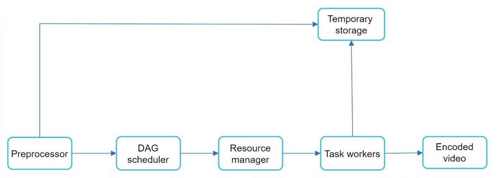

1.  **Preprocessor:** Splits videos into smaller chunks (GOP alignment). It has 4 responsibilities.

    

        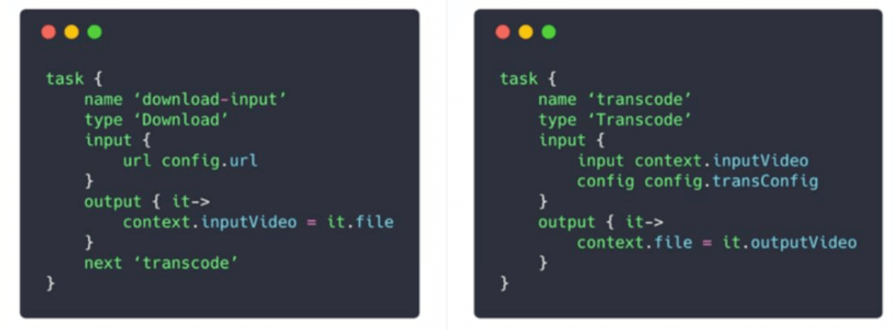
    

    - Video splitting: Video stream is split or further split into smaller Group of Pictures (GOP) alignment.
    - It split videos by GOP alignment for old clients.
    - It generates DAG based on configuration files client programmers write.
    - It stores GOPs and metadata in temporary storage in case the encoding fails, the system could use persisted data for retry operations.

2.  **DAG Scheduler:** Organizes tasks into sequential or parallel stages.
    

        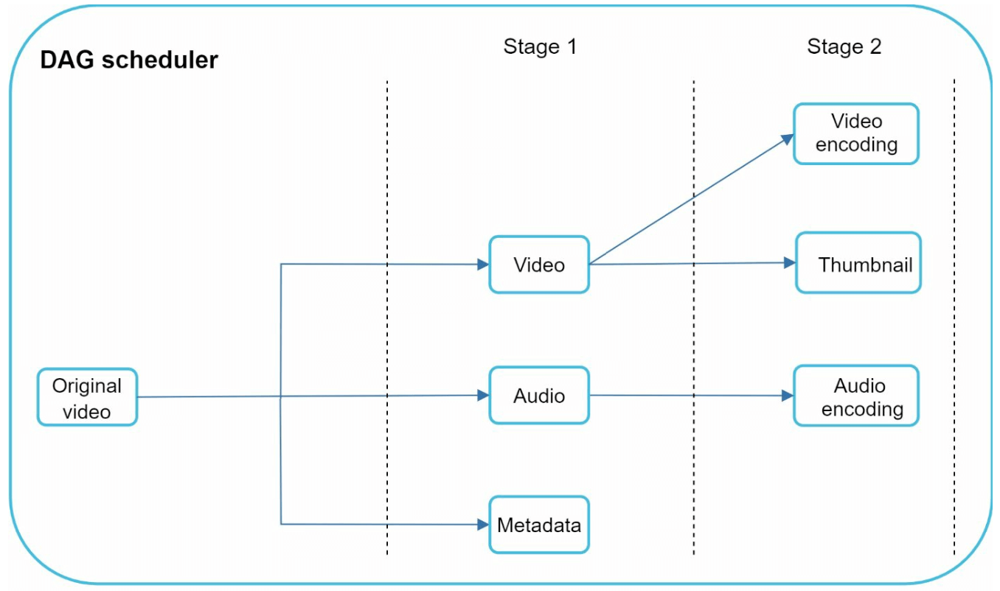
    

    - It splits a DAG graph into stages of tasks and puts them in the task queue in the resource manager.
    - Stage 1: video, audio, and metadata.
    - The video file is further split into two tasks in stage 2: video encoding and thumbnail.

3.  **Resource Manager:** Responsible for managing the efficiency of resource allocation.It
    contains 3 queues and a task scheduler.
    

    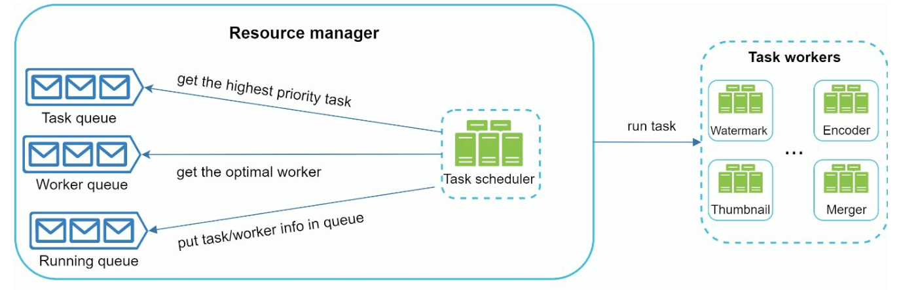
    

        - Task queue: priority queue that contains tasks to be executed.
        - Worker queue: priority queue that contains worker utilization info.
        - Running queue: contains  currently running tasks and workers running the tasks.
        - Task scheduler: picks the optimal task/worker, and instructs the chosen task worker to execute the job.

4.  **Task Workers:** Perform transcoding and other operations.
     

         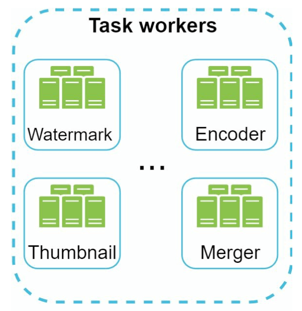
    

    - Different task workers may run different tasks

5.  **Temporary Storage:** Stores intermediate data for retries.
    - The choice of storage system depends on factors like data type, data size, access frequency, data life span, etc.
6.  **Output:** Transcoded videos ready for distribution.

---

## System Optimizations

### Speed Optimizations

1. **Parallel Video Uploads:** Split videos into smaller chunks for faster, resumable uploads.

2. **Distributed Upload Centers:** Use CDNs as upload hubs close to users.
3. **Parallel Processing:** Decouple modules using message queues for high parallelism.

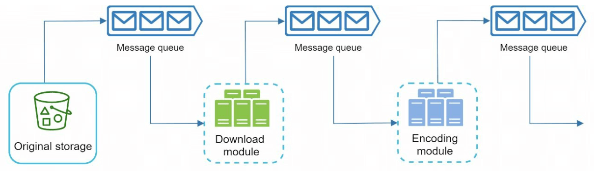
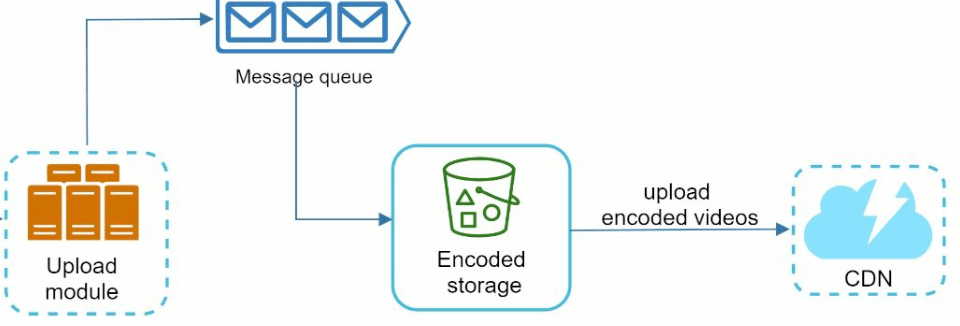

### Safety Optimizations

1. **Pre-Signed URLs:** Restrict video uploads to authorized users.

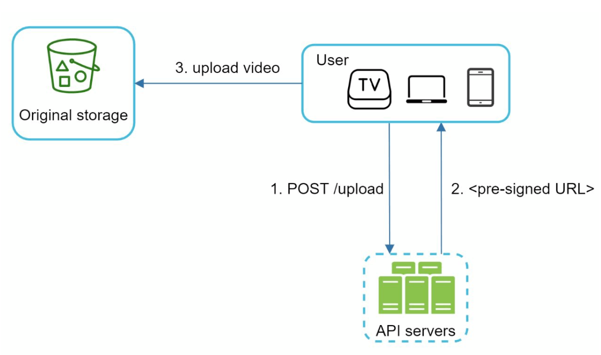

2. **Protect Videos:**
   - **DRM Systems** (e.g., Apple FairPlay, Google Widevine).
   - **AES Encryption.**
   - **Watermarking.**

### Cost-Saving Optimizations

1. Serve only popular videos via CDN; less popular ones from high-capacity servers.
2. Encode on-demand for rarely accessed videos.
3. Regionalize video distribution based on popularity.
4. Build custom CDNs and partner with ISPs to reduce bandwidth costs.

---

## Error Handling

### Recoverable Errors

- Retry failed uploads, transcoding, or resource allocation tasks.

### Non-Recoverable Errors

- Stop malformed video processing and return error codes.
