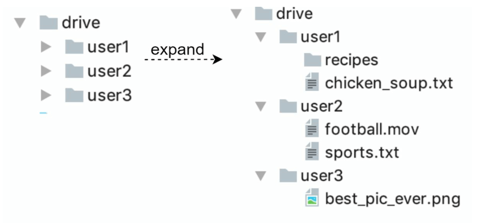
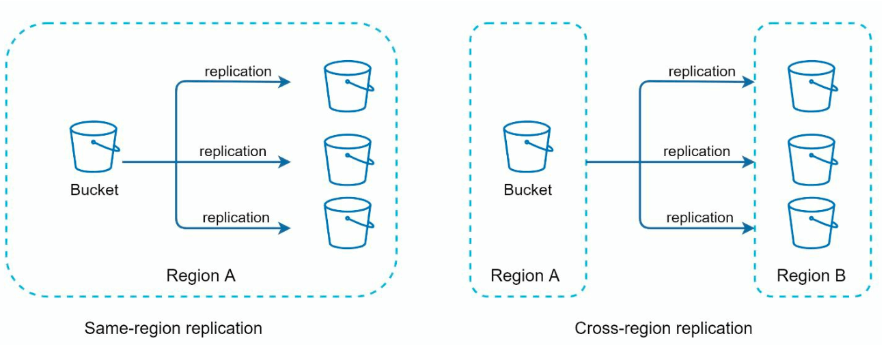
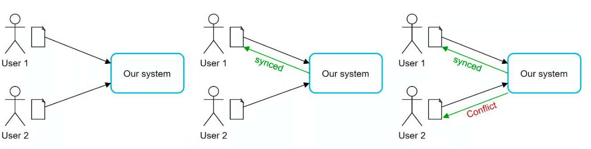
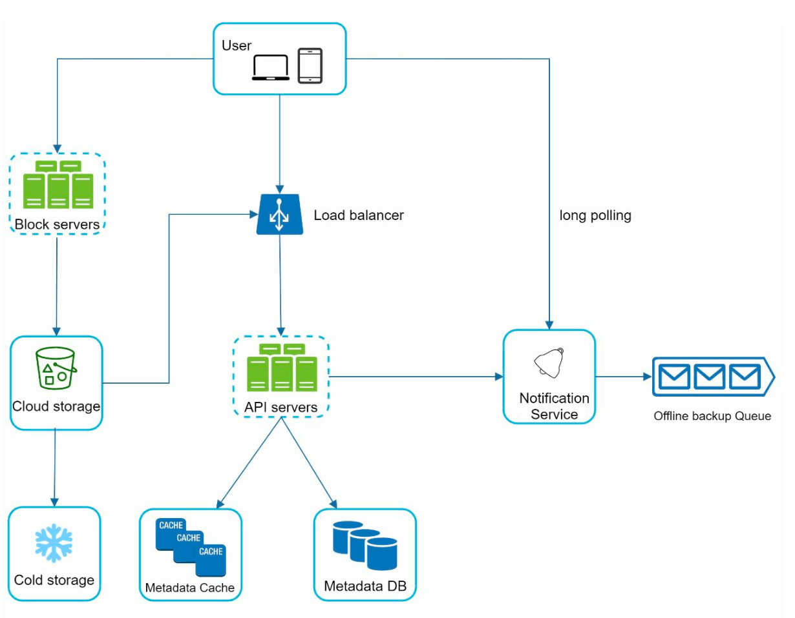
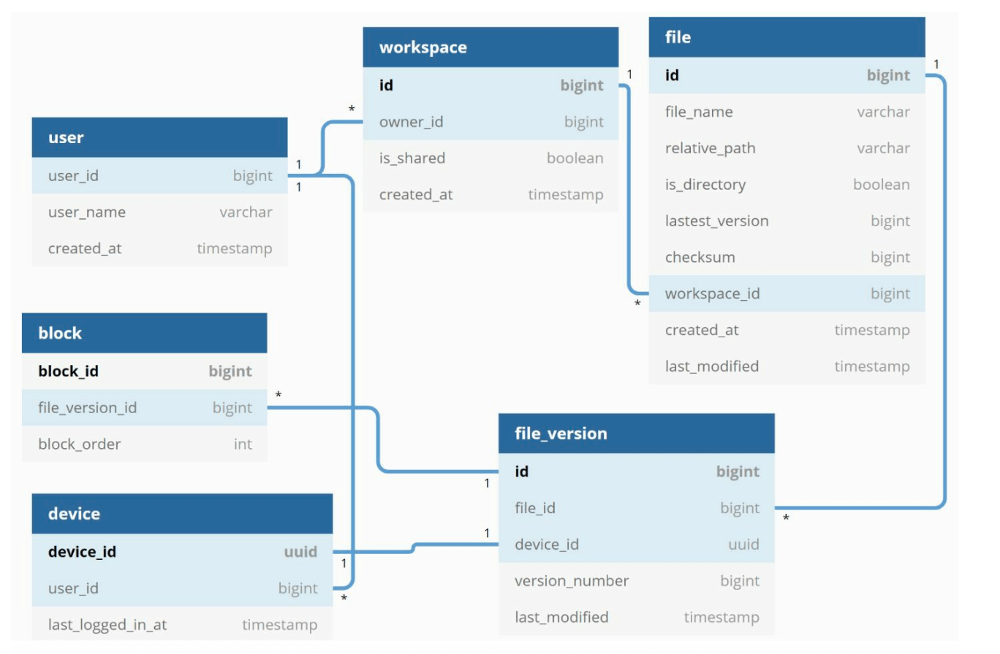
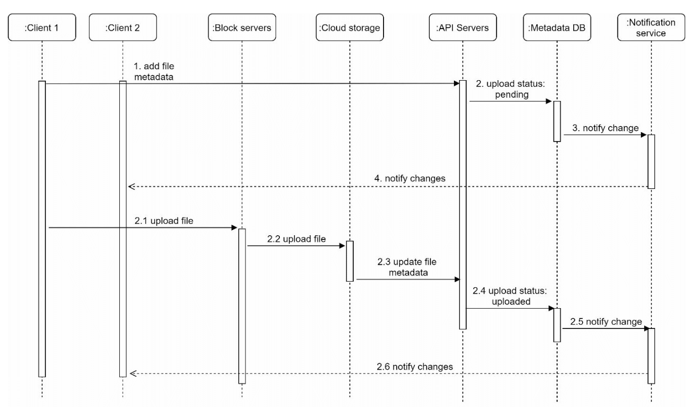
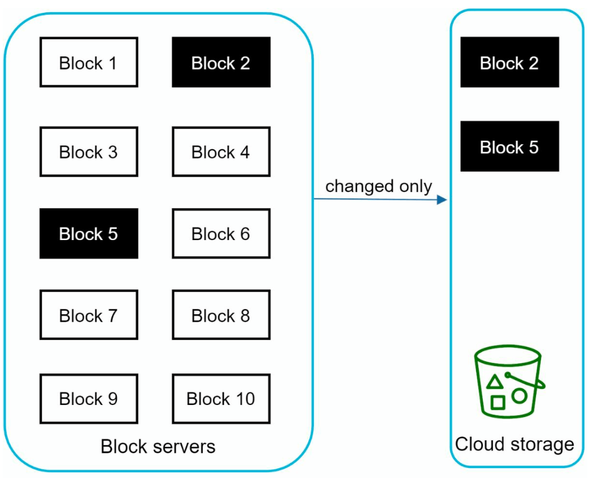
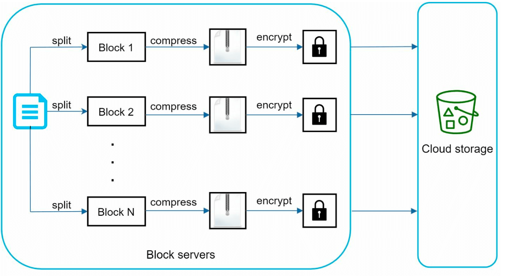
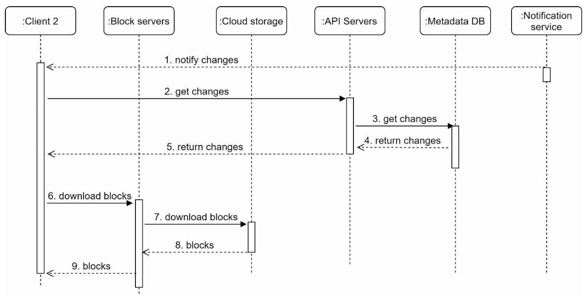

# Chapter 15: Design Google Drive

## Introduction

Google Drive is a cloud-based file storage and synchronization service that allows users to store, access, and share files from various devices. This chapter discusses designing a scalable system with the following features:

- **File Upload and Download**
- **File Sync Across Devices**
- **File Sharing**
- **File Revision History**
- **Notifications for Edits, Deletes, and Shares**

---

## Step 1: Understanding the Problem

### Key Requirements

#### Functional Requirements:

- Upload and download files.
- Sync files across multiple devices.
- Maintain file revisions.
- Enable file sharing with permissions.
- Send notifications on file edits, deletions, and shares.

#### Non-Functional Requirements:

- **Reliability:** Data loss is unacceptable.
- **Fast Sync Speed:** Avoid user impatience with delayed syncing.
- **Bandwidth Efficiency:** Minimize unnecessary data usage.
- **Scalability:** Handle 10 million daily active users (DAU).
- **High Availability:** Operate seamlessly during server failures or network issues.

### Constraints and Assumptions

- Users get **10 GB free space**.
- Maximum file size: **10 GB**.
- Average file upload size: **500 KB**.
- Upload frequency: **2 files per day per user**.
- Total storage required: **500 PB**.

---

## Step 2: High-Level Design

### Single-Server Setup

A basic setup includes:

1. **Web Server:** Handles uploads and downloads.
2. **Metadata Database:** to keep track of metadata like user data, login info, files info/
3. **Storage Directory:** Holds files organized by namespaces.

    

- A web server and a directory called drive/ is set up as the root directory to store uploaded files.
- Under drive/ directory, there is a list of directories called namespaces.
- Each namespace contains all the uploaded files for that user.
- Each file or folder can be uniquely identified by joining the namespace and the relative path.

This design serves as a starting point but is inadequate for scaling.

#### APIs

1. **Upload a file to Google Drive:** Two types of uploads are supported
   - Simple upload: Used when file size is small.
   - Resumable upload:
     - Endpoint: https://api.example.com/files/upload?uploadType=resumable
     - Send the initial request to retrieve the resumable URL.
     - Upload the data and monitor upload state
     - If upload is disturbed, resume the upload.
2. **Download a file from Google Drive:** To download a file
   - Endpoint: https://api.example.com/files/download
3. **Get file revisions:**
   - Endpoint: https://api.example.com/files/list_revisions

### Moving to Distributed Systems

#### Improvements:

1. **Sharding:** Split storage across servers based on `user_id`.
2. **Amazon S3:** Use S3 for scalable and redundant file storage with cross-region replication.

3. **Load Balancer:** Distribute traffic across multiple web servers.
4. **Metadata Database Replication:** Ensure availability through database sharding and replication.

#### Sync Conflicts:

For a large storage system like Google Drive, sync conflicts happen from time to time.
When two users modify the same file or folder at the same time, a conflict happens.

- In the example user 1 and user 2 tries to update the same file at the same time, but user 1’s file is processed by our system first.
- User 1’s update operation goes through, but, user 2 gets a sync conflict.
- The system presents both copies of the same file: user 2’s local copy and the latest version from the server.
- User 2 has the option to merge both files or override one version with the other.

### Improved design

1. **User Interaction:**: Users access the application via browser or mobile app.

2. **Block Servers:**

   - Files are split into **4 MB blocks** (maximum size) and assigned unique hash values.
   - Blocks are stored independently in cloud storage (e.g., Amazon S3).
   - File reconstruction involves joining blocks in a specific order.

3. **Cloud Storage:** Blocks are stored in cloud storage for scalability and redundancy.

4. **Cold Storage:** Inactive files are moved to cold storage to reduce costs.

5. **Load Balancer:** Distributes requests evenly among API servers to ensure efficient operation.

6. **API Servers:**

   - Handle user authentication, profile management, and file metadata updates.
   - Manage all non-uploading workflows.

7. **Metadata Database and Cache:**

   - Stores metadata for users, files, blocks, and versions.
   - Frequently accessed metadata is cached for faster retrieval.

8. **Notification Service:**

   - A **publisher/subscriber system** that notifies clients about file changes (add, edit, delete).
   - Ensures clients can pull the latest updates.

9. **Offline Backup Queue:** Temporarily stores file change information for offline clients to sync when back online.

---

## Step 3: Design Deep Dive

### Metadata Database

A highly simplified is shown below version as it only includes the most important tables and fields.

#### Schema Design:

- **User Table:** Stores user profiles and preferences.
- **File Table:** Maintains file metadata (e.g., size, name, path).
- **Block Table:** Tracks file blocks for reconstructing files.
- **File Version Table:** Stores file revision history.

---

### File Upload Flow

1. **File Upload:**
   - File is split into blocks, compressed, and encrypted by the block server.
   - Blocks are uploaded to block servers and stored in S3.
2. **Metadata Upload:**
   - Client sends metadata to the API server.
   - Metadata is stored in the database with status `pending`.
3. **Completion:**
   - S3 triggers a callback to update the file status to `uploaded`.
   - Notification service informs relevant users.

---

### File Sync

1. **Delta Sync:** Transfer only modified blocks instead of the entire file.

2. **Compression:** Blocks are compressed using compression algorithms depending on file types.
3. **Conflict Resolution:**
   - First processed version wins.
   - Conflicting versions are saved separately for user resolution.

---

### File Download Flow

Download flow is triggered when a file is added or edited elsewhere. There are two ways a client can know:

- If client A is online while a file is changed by another client, notification service will inform client A.
- If client A is offline while a file is changed by another client, data will be saved to the cache. When the offline client is online again, it pulls the latest changes.

Once a client knows a file is changed, it first requests metadata via API servers, then
downloads blocks to construct the file.

1. **Trigger:** Notification service informs the client of file updates.
2. **Metadata Fetch:** Client retrieves updated metadata via API.
3. **Block Download:** Client downloads updated blocks from block servers and reconstructs the file.

---

### Notification Service

1. **Purpose:** Keeps clients updated about file changes.
2. **Mechanism:** Implements **long polling** for asynchronous notifications.
3. **Example:** When a file is added, edited, or deleted, notifications are pushed to all relevant clients.

---

### Storage Optimization

1. **De-duplication:** Remove duplicate blocks at the account level using hash-based comparisons.
2. **Versioning Strategy:**
   - Limit the number of saved revisions.
   - Prioritize recent versions for frequently edited files.
3. **Cold Storage:** Move rarely accessed files to cheaper storage solutions (e.g., Amazon S3 Glacier).

---

### Failure Handling

1. **Load Balancer Failure:** Secondary load balancer becomes active.
2. **Block Server Failure:** Pending tasks are reassigned to other servers.
3. **Metadata Database Failure:**
   - Promote a slave node to master.
   - Redirect traffic to remaining replicas.
4. **Cloud Storage Failure:** Use cross-region replication to fetch unavailable files.
5. **Notification Service Failure:** Clients reconnect to alternative servers.
