# Chapter 16: Proximity Service

## Introduction

A **proximity service** is designed to find nearby locations, such as restaurants, hotels, gas stations, and other businesses. This functionality is used in applications like **Google Maps** and **Yelp** to help users discover places within a defined radius.

## Step 1: Understanding the Problem and Establishing Scope

### **Functional Requirements**

1. **Search for businesses** based on user location (latitude, longitude) and search radius.
2. **Allow business owners** to add, update, or delete businesses (not real-time).
3. **Provide detailed business information** when requested.

### **Non-Functional Requirements**

- **Low latency**: Users should get quick responses.
- **Data privacy**: Compliance with GDPR and CCPA regulations.
- **High availability**: Handle peak-hour spikes in busy locations.

### **Back-of-the-Envelope Estimation**

- **100 million daily active users**.
- **200 million businesses** in the system.
- **Search QPS Calculation**:
  - Users make **5 searches per day**.
  - **Search QPS** = (100M × 5) / 86,400 ≈ **5,000 QPS**.

---

## Step 2: High-Level Design

### **API Design**

#### **Search Nearby Businesses**

GET /v1/search/nearby

- **Request Parameters**:
  - `latitude`: User’s location latitude.
  - `longitude`: User’s location longitude.
  - `radius`: Search radius (default: 5000m).

#### **Business APIs**

| API Endpoint                 | Description                       |
| ---------------------------- | --------------------------------- |
| `GET /v1/businesses/{id}`    | Fetch detailed business info      |
| `POST /v1/businesses`        | Add a new business                |
| `PUT /v1/businesses/{id}`    | Update business details           |
| `DELETE /v1/businesses/{id}` | Remove a business from the system |

### **Data Model**

- Since the read volume is high because two features are very commonly used, a realtional database such as MySQL is a good fit.
  - Search for nearby businesses
  - View the detailed information of a business

### **Data Schema**

- Key Database tables are the business table and the geospatial index table
- The business table consists the detailed information about a business.

### **High-Level System Architecture**

The system comprises of two parts: Location based service (LBS) and business related service.

<div style="margin-left:3rem">
    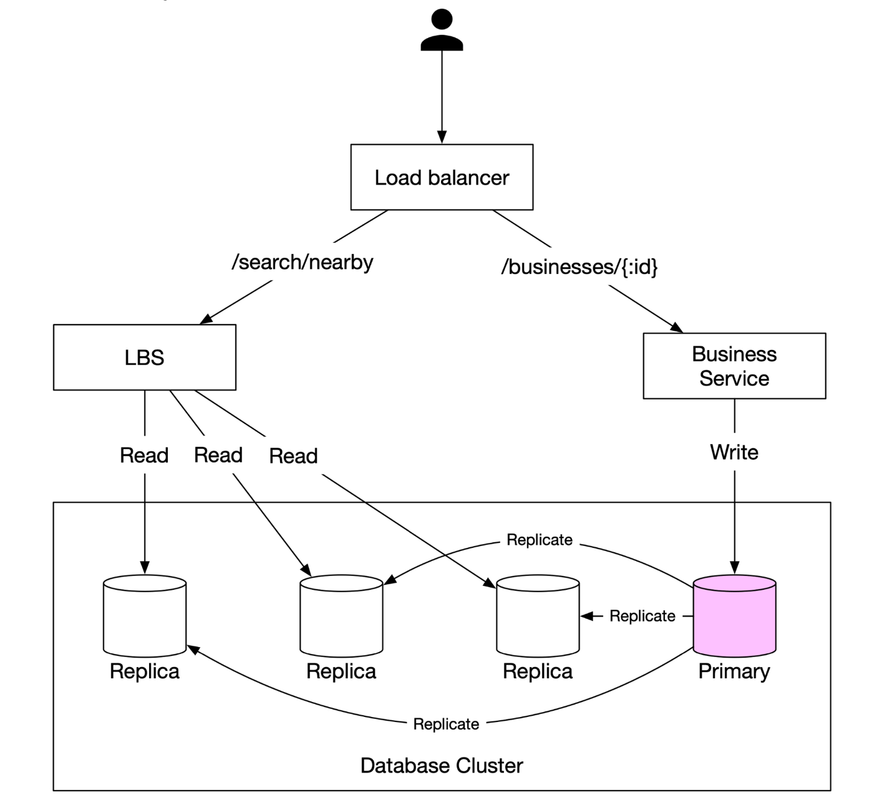
</div>

- **Location-Based Service (LBS)**:
  - Processes location-based search queries.
  - Read-heavy service with no write requests.
  - QPS is high especially during peak hours in dense areas and the system is stateless.
- **Business Service**: Deals with two types of requests.
  - Business owners create, update or delete businesses.
  - Customers view detailed information about a business.
- **Load Balancer**: Routes traffic to LBS and Business service.
- **Database Cluster**:
  - Uses **primary-replica architecture** for read-heavy workloads.
  - There might be some discrepancy between data read b/w data read by LBS and data written by by primary database.
  - This incosistency is not an issue beacuase the business information is not updated in real-time.

---

## Step 3: Algorithms for Fetching Nearby Businesses

### **Option 1: Two-Dimensional Search (Naive Approach)**

<div style="margin-left:3rem">
    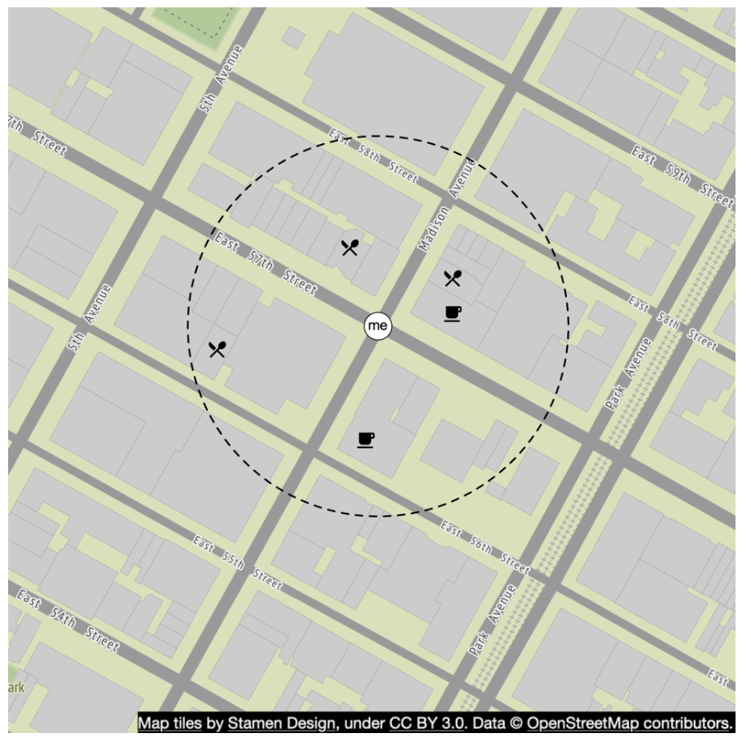
</div>

The most intuitive way is to draw a circle with pre-defined radius and find all the businesses within the circle.

**SQL Query:**

```
SELECT business_id, latitude, longitude
FROM business
WHERE (latitude BETWEEN :lat - radius AND :lat + radius)
AND (longitude BETWEEN :long - radius AND :long + radius);
```

**Problems:**

- **Inefficient**: Requires scanning the entire database.
- **Limited by one-dimensional indexes** (latitude/longitude).

A potiential improvement is to build index on logitude and latitude columns, alhtough this is slighlty better but still vry slow.

### Better Approach

- The problem with last approach is that the database index can only increase search speed in one dimension.
- An optimal apporach is to reprsent the two-dimensional data into one dimension using geospatial indexing.

  - Hash: Even grid, Geo Hash
  - Tree: Quadtree, Google S2, RTree

  <div style="margin-left:3rem">
    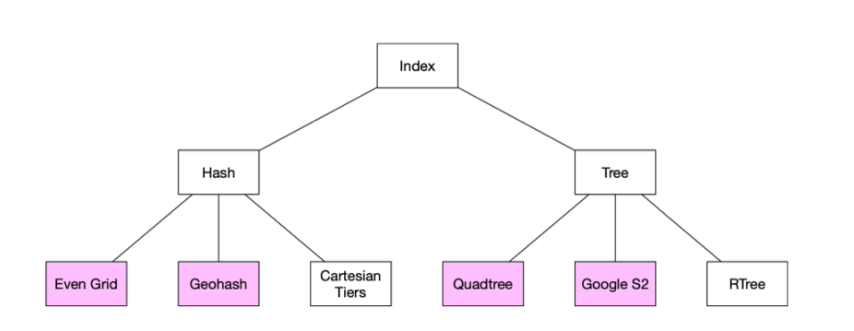
  </div>

### **Option 2: Evenly Divided Grid**

  <div style="margin-left:3rem">
    
  </div>

- **Divides the world into fixed-size grids**.
- **Issue**: Uneven business distribution (high density in cities, sparse in rural areas).

### **Option 3: Geohash**

- Divide the planet into four quadrants along with the prime meridian and equator. And then divide each grid into four smaller grids.
- Each grids can be represented by altering b/w longitude and latitude bit.
- Repeat this subdivision

  <div style="margin-left:3rem">
    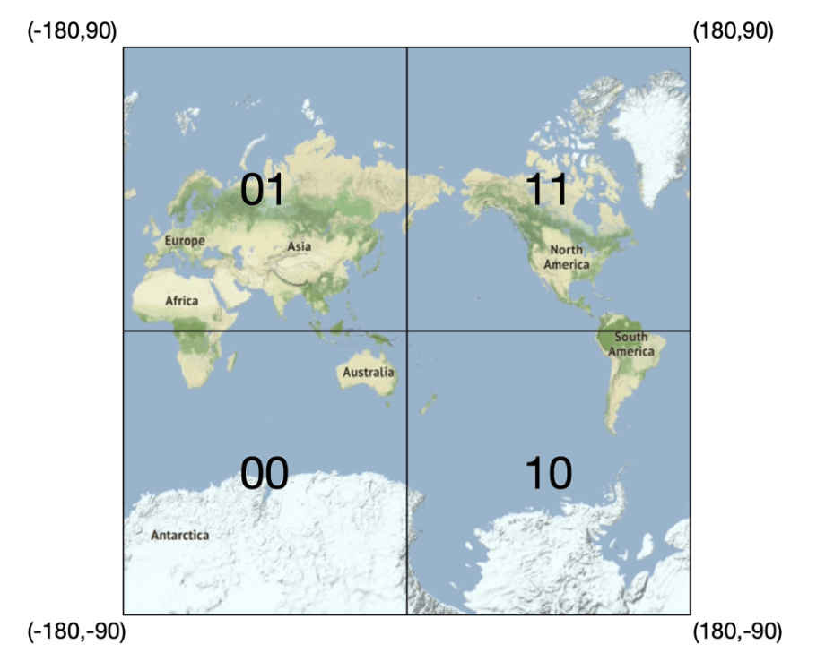
    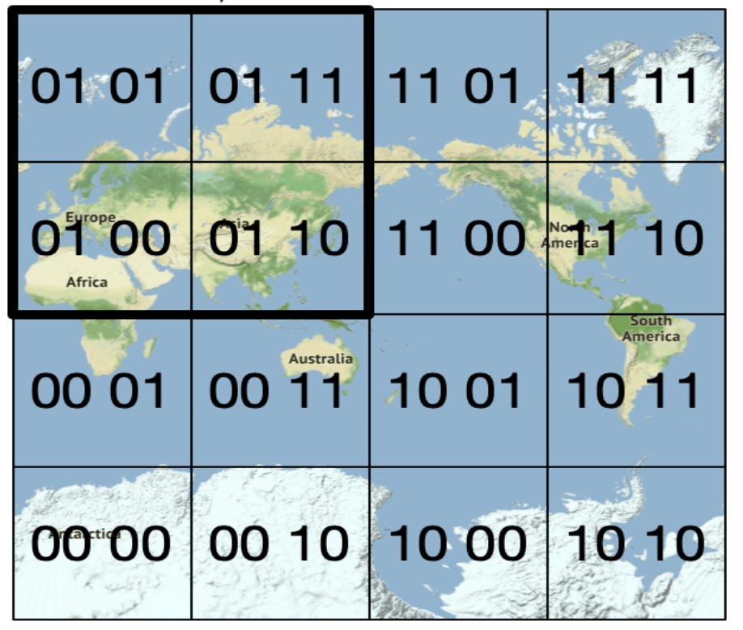
  </div>

- **Encodes latitude and longitude into a single alphanumeric string**. It has 12 precisions (levels)
- **Hierarchical grid structure** allows for efficient searching.
- The right precision is chosen by using the minimal geohash length according to the table.
  <div style="margin-left:3rem">
    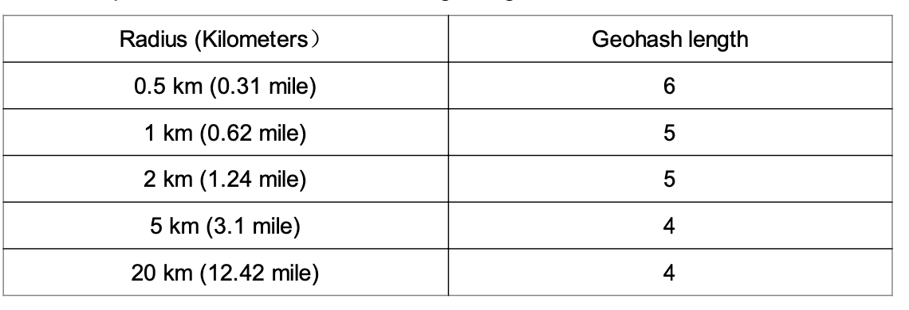
  </div>
- Geohash guarantees that the longer a shared prefix is between two geohashes, the closer they are.

- **Challenges**:
  <div style="margin-left:3rem">
    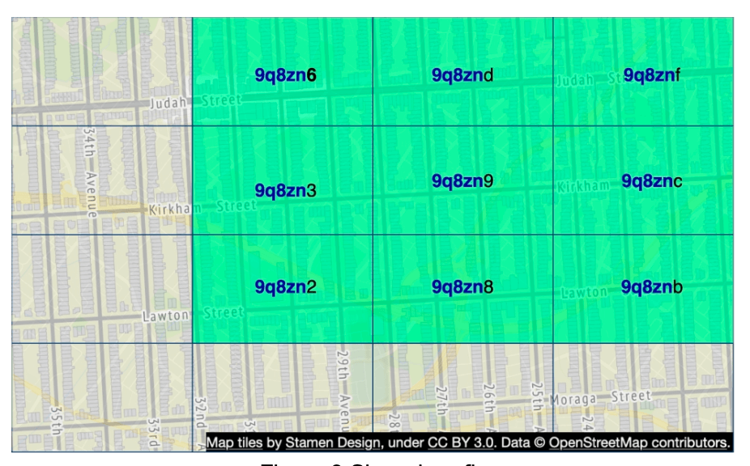
  </div>

  - **Boundary issues** (businesses close to grid edges may get excluded).
    - Two locations can be very close but have no shared prefix at all (can be on other side of equator)
    - Two locations can have a long shared prefix but belong to different geohashes.
  - Solution: Need to search neighboring grids.

### **Option 4: Quadtree**

A quadtree is a tree data structure that recursively divides a two-dimensional space into four quadrants, with each internal node having exactly four children, representing the four sub-regions of the space.

- The quadtree is an in-memory data structure and it runs on each LBS server and built on server startup time.

  <div style="margin-left:3rem">
    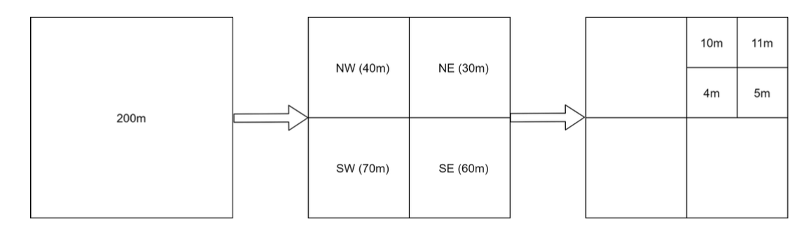
  </div>

- The root node is recursively broken down into 4 quadrants until no nodes are left with more than x number of businesses (100 in this case).

  <div style="margin-left:3rem">
    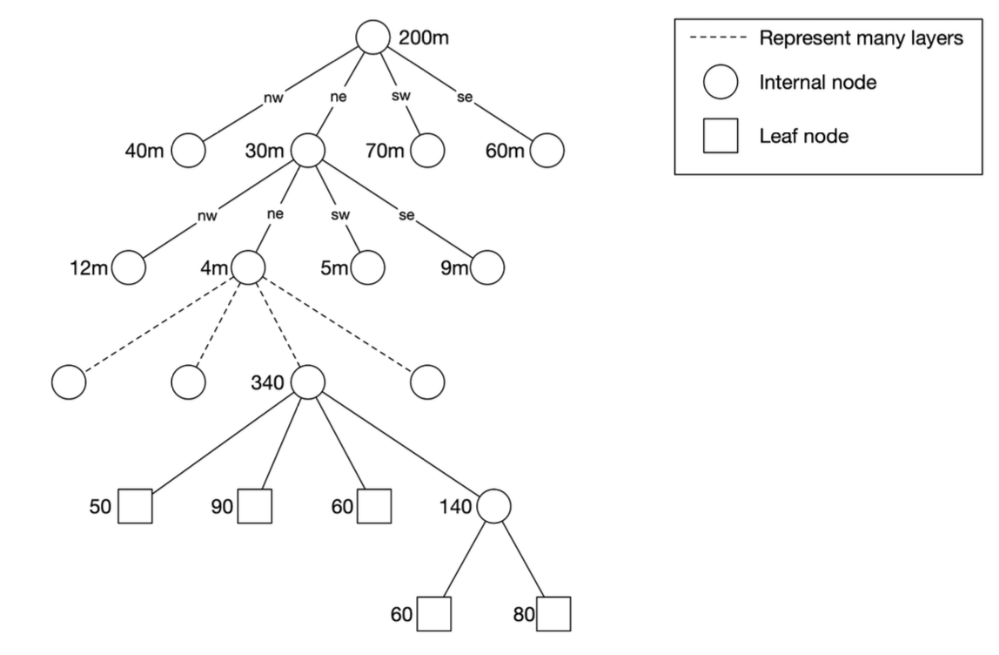
  </div>

- The quadtree index doen't take too much memory (typically in GBs) and can easily fit in one server.
- Since tge time complexity to build the tree is nlogn, it might take a few minutes to build the tree.
- **Efficient for k-nearest search queries** (e.g., find the closest gas station).

  <div style="margin-left:3rem">
    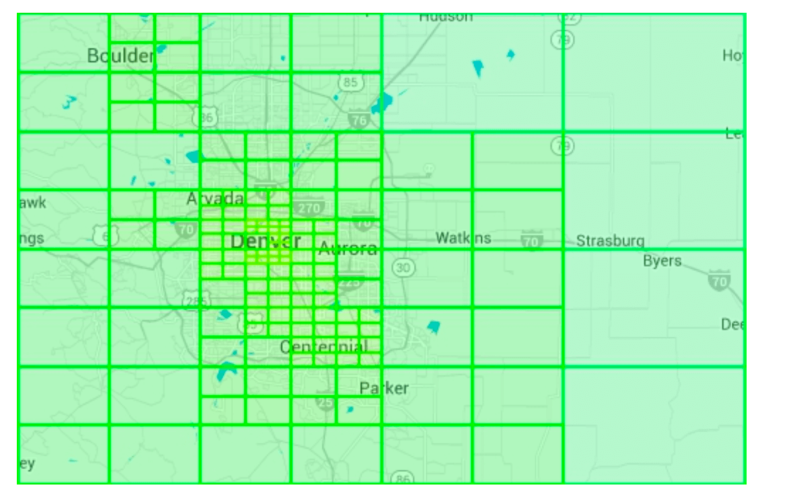
  </div>

#### Operational considerations

- For around 200 million businesses, it might take few minutes to build a quadtree at the server start time.
- While the quadtree is built it cannot serve traffic, therefore a new release should be rolled out incrementally to a subset of servers.
- When updating a business or adding a new the easiest approach is to incrementally rebuild the quadtree. (Leading to a lot of cache invalidation)
- Also possible to update the quadtree on the fly but more complex to implement. (Needs locking mechanism)

### **Option 5: Google S2**

It maps a sphere to a !D index based on Hilbert curve.Two points that are close to each other on the Hilbert curve are close in 1D space.

  <div style="margin-left:3rem">
    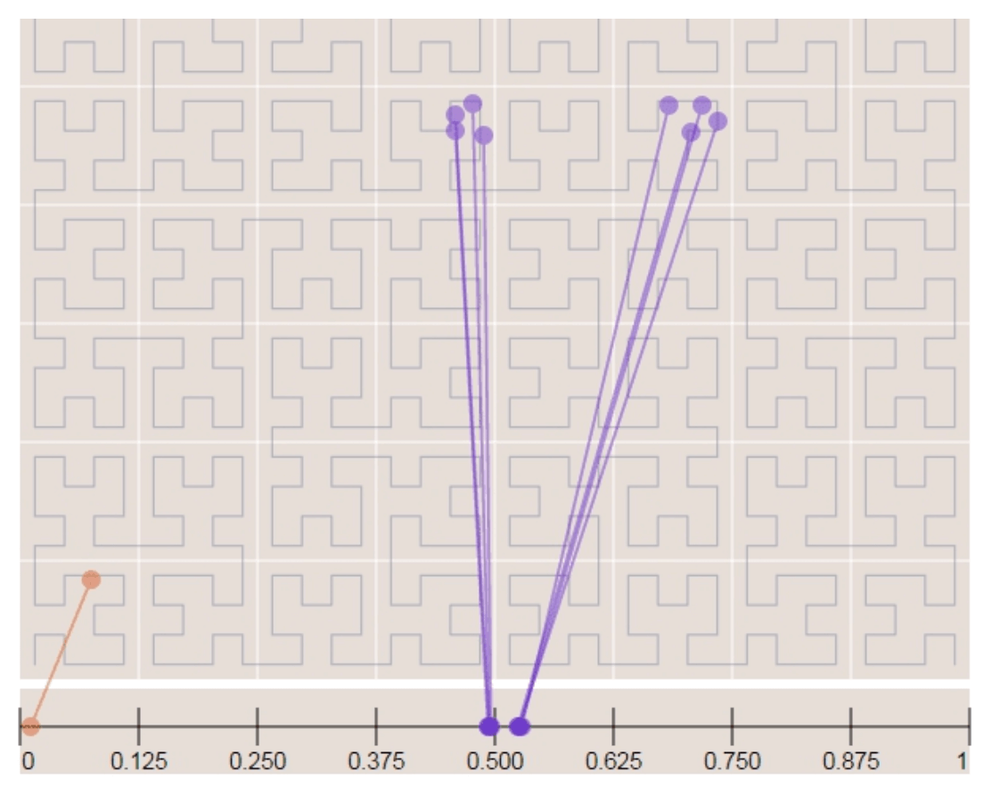
    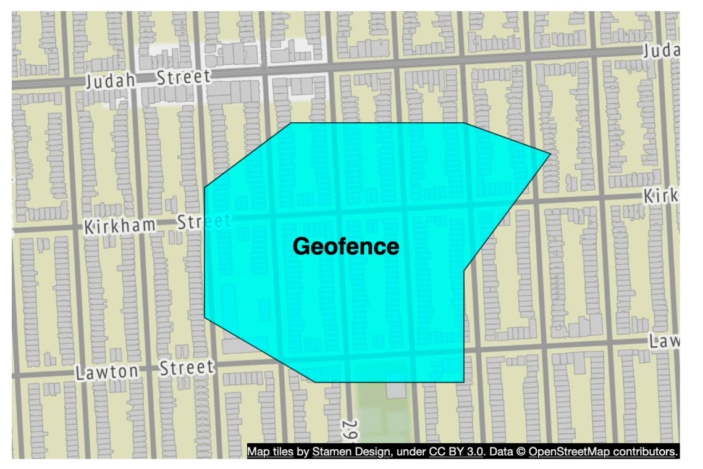
  </div>

- **Divides the earth into small cells using a Hilbert curve**.
- Great for geofencing becuase it can cover arbitrary areas with varying levels.
- Geofencing also allows to define parameters that surround the area of interest.
- Aother advantage if instead of having a fixed level of precision, we can specify min,max level and max cells in S2.

## Tradeoff Comparison

#### Geohash

- Easy to use and implement- No need to build/rebuild a tree
- Supports fixed radius results
- Updating the index is easy.
- Cannot dynamically adjust the grid size based on population density.

#### Quadtree

- Slightly harder to implement.
- Supports fetching k-nearest businesses.
- Can dynamically adjust the grid size based on population desnsity.
- Updating the index is more complicated as might need to rebuild the whole tree.

---

## Step 4: Scaling the Database and Caching Strategy

### **Scaling the Business Table**

- **Sharding by business ID** ensures even data distribution.
- We have separate rows for each business in the table.

| Geohash | Business ID |
| ------- | ----------- |
| 9q9hvu  | 343         |
| 9q9hvu  | 347         |
| 9q9hvu  | 112         |

### **Scaling the Geospatial Index**

- Might not be a good fit for the geohash table. In this case everything can fit in a single server so there's no tehcnical reason for sharding.
- A better approach is to have read-replicas to help with read loads.

---

### **Cache Strategy**

The most obvious cache key choice is the location coordinate, however it has a few issues:

- Location coordinates from gps are not accurate.
- A user can move casuing the location coordinate to change.
- A better key is the geohash.

| Cache Key     | Cache Value                                     |
| ------------- | ----------------------------------------------- |
| `geohash`     | List of business IDs in that grid               |
| `business_id` | Business details (name, address, reviews, etc.) |

---

## Step 5: Deployment Strategy and Final Architecture

### **Region and Availability Zones**

- Deploy LBS and Business Service **across multiple regions**.

### **Handling Real-Time Updates**

- **Business updates are batch processed daily**.

### **Final System Architecture**

  <div style="margin-left:3rem">
    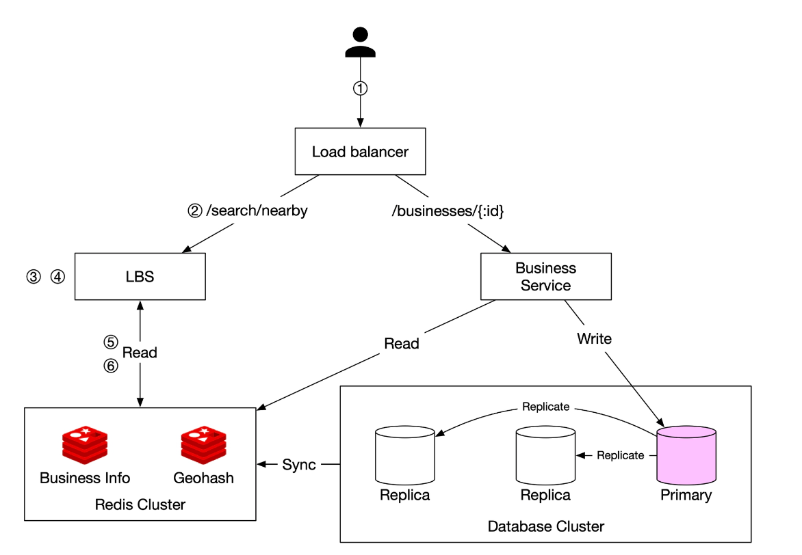
  </div>

This final algorithm looks like this:

## Steps to Retrieve Nearby Businesses

1. **User Request:**

   - A user searches for restaurants within **500 meters**.
   - The client sends **latitude (37.776720), longitude (-122.416730), and radius (500m)** to the **load balancer**.

2. **Request Forwarding:**

   - The **load balancer (LB)** forwards the request to the **Location-Based Service (LBS)**.

3. **Geohash Calculation:**

   - LBS determines the **geohash length** matching the radius.
   - Using a reference table, **500m corresponds to geohash length = 6**.

4. **Fetching Neighboring Geohashes:**

   - LBS calculates **neighboring geohashes** to include nearby areas.
   - The result is a list:
     ```
     [my_geohash, neighbor1_geohash, neighbor2_geohash, ..., neighbor8_geohash]
     ```

5. **Fetching Business IDs from Redis:**

   - For each geohash in the list, LBS queries the **Geohash Redis server** to fetch **business IDs**.
   - Parallel queries are used to minimize latency.

6. **Retrieving & Ranking Businesses:**
   - LBS fetches **full business details** from the **Business Info Redis server**.
   - Businesses are **sorted by distance** from the user’s location.
   - The **ranked results** are sent back to the client.

## Key Optimizations

- **Parallel Redis Calls**: Reduces response time.
- **Geohash Indexing**: Ensures efficient spatial queries.
- **Caching**: Speeds up lookup and retrieval of business data.

This method ensures **low-latency, scalable** retrieval of businesses near a user’s location.

---

### **Choosing the Best Indexing Method**

| Indexing Method | Pros                                                       | Cons                                    |
| --------------- | ---------------------------------------------------------- | --------------------------------------- |
| **Geohash**     | Easy to implement, efficient for proximity search          | Boundary issues, fixed grid size        |
| **Quadtree**    | Dynamically adjusts to density, supports k-nearest queries | More complex, requires tree rebalancing |
| **Google S2**   | Advanced geofencing, used in Google Maps                   | Harder to implement                     |

---

## References

1. [Geohash Algorithm](https://www.movable-type.co.uk/scripts/geohash.html)
2. [Quadtree Indexing](https://en.wikipedia.org/wiki/Quadtree)
3. [Google S2 Geometry](https://s2geometry.io/)
